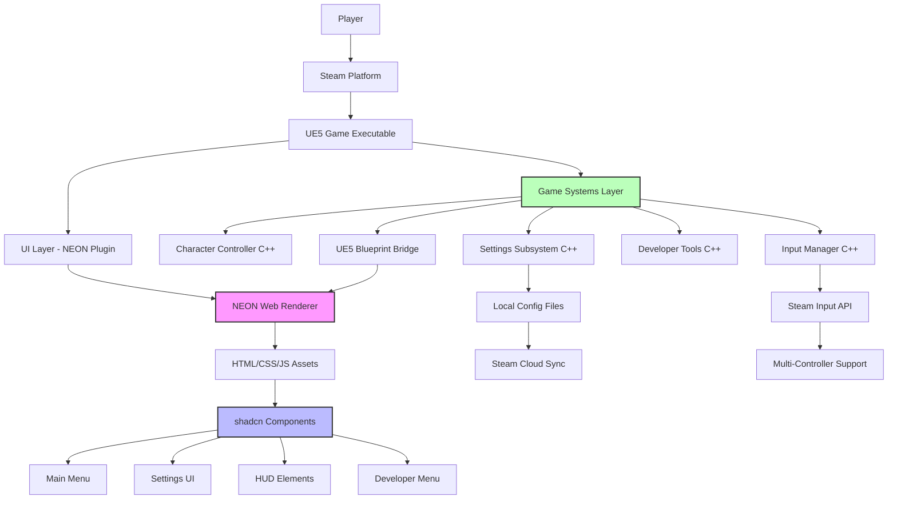
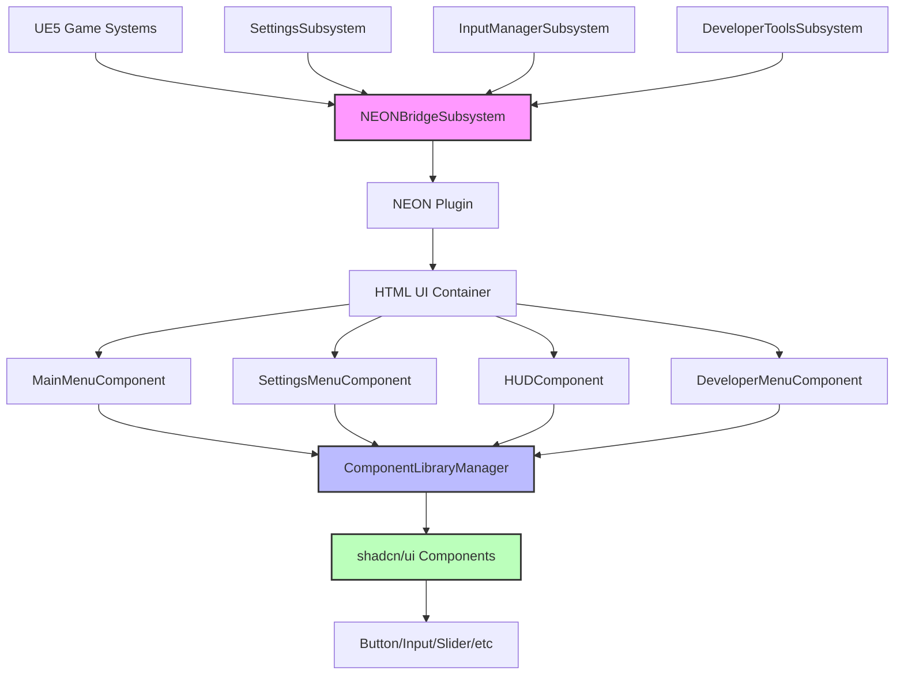
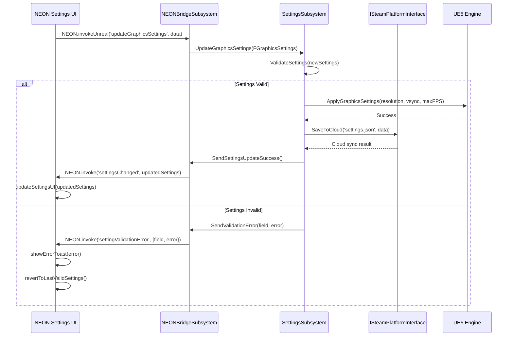
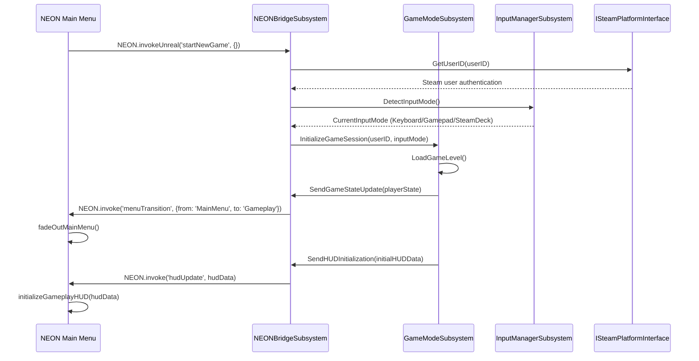
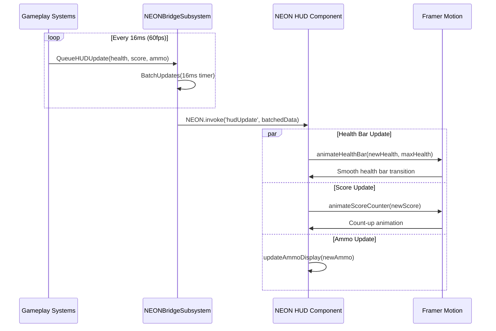
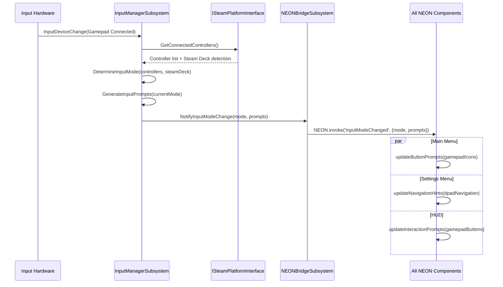
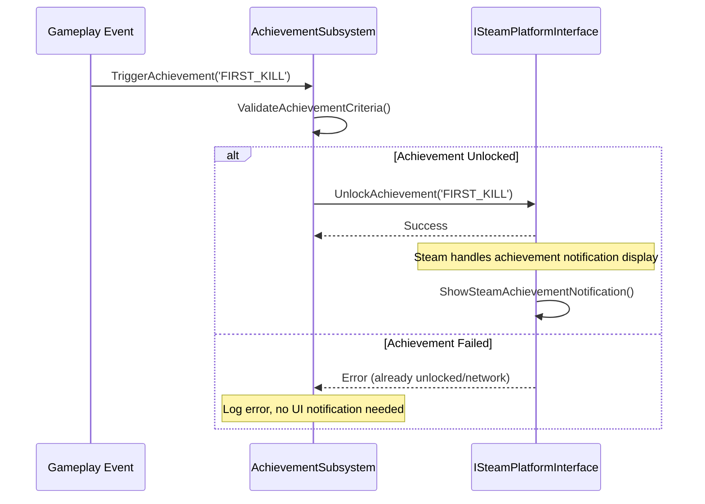
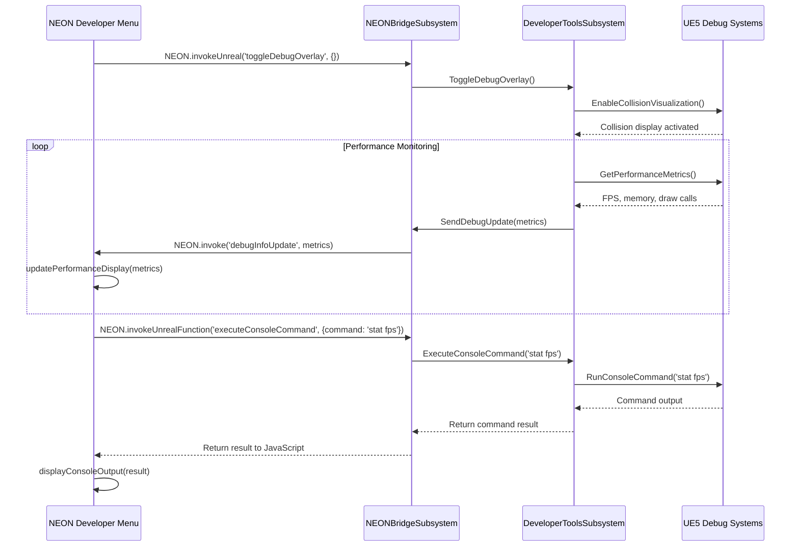

# NohamBaseProject Fullstack Architecture Document

## Introduction

This document outlines the complete fullstack architecture for **NohamBaseProject**, including backend systems, frontend implementation, and their integration. It serves as the single source of truth for AI-driven development, ensuring consistency across the entire technology stack.

This unified approach combines what would traditionally be separate backend and frontend architecture documents, streamlining the development process for modern fullstack applications where these concerns are increasingly intertwined.

### Starter Template or Existing Project

Based on the PRD analysis, this is a **greenfield UE5 project** with specific technology constraints:

- **Base:** Unreal Engine 5.5.4 (specific version for consistency)
- **Unique Approach:** NEON plugin integration for HTML/JavaScript UI within UE5 widgets
- **Target Platform:** Steam PC primary, Steam Deck secondary
- **Architecture:** Traditional UE5 C++ structure with web-based UI layer

**Decision:** Custom UE5 base project with NEON+shadcn integration (no existing game engine starter templates apply to this unique web-UI-in-game-engine approach)

### Change Log

| Date | Version | Description | Author |
|------|---------|-------------|---------|
| 2025-10-25 | v1.0 | Initial fullstack architecture from PRD | Winston (Architect) |

## High Level Architecture

### Technical Summary

**NohamBaseProject** employs a **hybrid native-web architecture** within Unreal Engine 5.5.4, where traditional C++ game systems are coupled with HTML/JavaScript UI layers via NEON plugin integration. The frontend uses **shadcn components** rendered within UE5 widgets, replacing traditional UMG with modern web UI patterns while maintaining native game performance. The backend consists of **modular UE5 subsystems** handling core gameplay, input management, and settings persistence. This architecture enables **rapid prototype development** by leveraging familiar web development workflows for UI creation while preserving the performance and platform integration capabilities of native UE5 development. **Steam PC deployment** with Steam Deck compatibility drives the platform strategy, focusing on desktop gaming performance with controller input support.

### Platform and Infrastructure Choice

Based on PRD requirements and the unique UE5+web hybrid approach, here are the viable platform options:

**Option 1: Steam Direct Deployment (Recommended)**
- **Pros:** Direct Steam integration, native performance, offline distribution, full UE5 feature access
- **Cons:** Requires Steam partnership, manual update distribution
- **Fit:** Perfect for indie game development with established Steam presence

**Option 2: Epic Games Store + UE5 Native**
- **Pros:** UE5 native toolchain, potentially reduced Epic Store fees
- **Cons:** Smaller market reach, less mature platform features
- **Fit:** Good alternative but Steam is specified as primary target

**Option 3: Multi-Platform (Steam + Epic + Itch.io)**
- **Pros:** Maximum market reach, diversified revenue streams
- **Cons:** Increased testing complexity, multiple deployment pipelines
- **Fit:** Future consideration after Steam validation

**Recommendation:** **Steam Direct with UE5 native deployment**
- Aligns with PRD's Steam PC primary focus
- Leverages existing studio success on Steam platform
- Native UE5 compilation maintains performance requirements
- Steam API integration supports controller detection and Steam Deck optimization

**Platform:** Steam PC (Primary), Steam Deck (Secondary)
**Key Services:** Steam API, Steam Input, Steam Cloud Saves, Steam Workshop (future)
**Deployment Host and Regions:** Steam global distribution network
**Performance Target:** 120+ FPS on medium hardware, 60+ FPS on Steam Deck

### Repository Structure

For UE5 projects with HTML UI integration, a **modified monorepo approach** works best:

**Structure:** Modified UE5 Monorepo with Web Assets Integration
**Monorepo Tool:** Native UE5 project structure with organized web assets
**Package Organization:** UE5 modules + HTML/CSS/JS components as content assets

This approach treats HTML/CSS/JS as **content assets** within the UE5 structure rather than separate packages, maintaining UE5's build system while organizing web components logically.

### High Level Architecture Diagram



### Architectural Patterns

- **Hybrid Native-Web Architecture:** UE5 C++ backend with HTML/JavaScript frontend via NEON plugin - _Rationale:_ Combines native performance with rapid web UI development workflows
- **Component-Based UI:** Reusable shadcn components within NEON widgets - _Rationale:_ Leverages mature web component ecosystem while maintaining game engine integration
- **Subsystem Pattern:** UE5 subsystems for cross-cutting concerns (input, settings, developer tools) - _Rationale:_ Ensures proper lifecycle management and global access across game systems
- **Bridge Pattern:** C++ to Blueprint to NEON communication layer - _Rationale:_ Enables type-safe communication between native code and web UI without tight coupling
- **Asset-Based Web Components:** HTML/CSS/JS treated as UE5 content assets - _Rationale:_ Maintains UE5 packaging and deployment workflows while organizing web code
- **Event-Driven UI Updates:** Game state changes trigger UI updates via event system - _Rationale:_ Ensures UI stays synchronized with game state without performance overhead

## Tech Stack

This is the **DEFINITIVE** technology selection for the entire project. All development must use these exact versions and tools.

### Technology Stack Table

| Category | Technology | Version | Purpose | Rationale |
|----------|------------|---------|---------|-----------|
| **Game Engine** | Unreal Engine | 5.5.4 | Core game runtime and development environment | Specific version for consistency across projects, proven stability |
| **Frontend Language** | HTML5/CSS3/JavaScript | ES2022 | UI development within NEON widgets | Modern web standards with broad browser compatibility |
| **Frontend Framework** | Vanilla JS + NEON | NEON May 28, 2025 | Web UI rendering within UE5 widgets | Direct control over performance, minimal overhead |
| **UI Component Library** | shadcn/ui | Latest (2025) | Professional UI component system | Production-ready components, excellent theming, accessibility built-in |
| **CSS Framework** | Tailwind CSS | 3.x | Utility-first styling for shadcn components | Required for shadcn, rapid styling, consistent design tokens |
| **Animation Library** | Framer Motion | 11.x | UI animations and micro-interactions | Performance optimized, declarative animations, accessibility support |
| **State Management** | Vanilla JS + UE5 Bridge | Custom | Game state synchronization with UI | Minimal overhead, direct UE5 integration, no unnecessary abstraction |
| **Backend Language** | C++ | C++20 | Native game systems and performance-critical code | UE5 standard, maximum performance, full engine feature access |
| **Backend Framework** | UE5 Framework | 5.5.4 | Game systems, subsystems, and Blueprint integration | Native UE5 patterns, proven architecture for game development |
| **API Style** | UE5 Blueprint/C++ Bridge | Native | Communication between game logic and UI | Direct function calls, type safety, minimal serialization overhead |
| **Database** | UE5 Config System | Native | Settings persistence and game state storage | Built-in persistence, Steam Cloud integration, no external dependencies |
| **Cache** | UE5 Asset Cache | Native | Asset loading and texture caching | Optimized for game assets, automatic memory management |
| **File Storage** | UE5 Content Browser | Native | Game assets, HTML/CSS/JS files as content | Integrated with UE5 packaging, version control friendly |
| **Authentication** | Steam API | Latest | Player identification and platform features | Required for Steam deployment, handles user accounts |
| **Frontend Testing** | Jest + Testing Library | Latest | HTML/CSS/JS component testing | Industry standard, good shadcn component support |
| **Backend Testing** | UE5 Automation Framework | Native | C++ and Blueprint testing | Integrated testing, game-specific test patterns |
| **E2E Testing** | Manual + UE5 PIE | Native | Full game flow testing | Play-in-Editor for rapid iteration, manual for user experience |
| **Build Tool** | Unreal Build Tool (UBT) | 5.5.4 | C++ compilation and project building | UE5 standard, handles complex dependencies |
| **Bundler** | UE5 Packaging | Native | Final game executable creation | Optimized game packaging, platform-specific builds |
| **Web Asset Bundler** | Vite | 5.x | HTML/CSS/JS bundling for NEON | Fast development builds, efficient production bundles |
| **IaC Tool** | N/A | N/A | Not applicable for desktop game deployment | Steam handles distribution infrastructure |
| **CI/CD** | GitHub Actions | Latest | Automated building and testing | Free for public repos, good UE5 community support |
| **Monitoring** | UE5 Stats System | Native | Runtime performance monitoring | Built-in profiling, game-specific metrics |
| **Logging** | UE5 Logging | Native | Debug and runtime logging | Categorized logging, configurable verbosity |
| **Icon Library** | Lucide Icons | Latest | SVG icons for UI components | shadcn standard, comprehensive game-appropriate icons |
| **Input Handling** | Steam Input + UE5 | Native | Multi-controller and platform input | Steam Deck compatibility, controller auto-detection |

## Data Models

The core data models define entities shared between the UE5 C++ backend and HTML/JavaScript frontend, enabling type-safe communication and consistent data handling across the hybrid architecture.

### GameSettings

**Purpose:** Centralizes all player-configurable settings with persistence and real-time preview capabilities

**Key Attributes:**
- `GraphicsSettings`: Object - Resolution, fullscreen mode, VSync, FPS cap, quality presets
- `AudioSettings`: Object - Master/Music/SFX/Voice volume levels, audio device selection
- `InputSettings`: Object - Key bindings, mouse sensitivity, gamepad configuration, dead zones
- `GameplaySettings`: Object - Movement speed, interaction range, accessibility options
- `DeveloperSettings`: Object - Debug overlays, performance metrics, collision visualization
- `MetaSettings`: Object - Language, UI scale, first-time setup flags

#### TypeScript Interface

```typescript
interface GameSettings {
  graphics: {
    resolution: { width: number; height: number };
    fullscreen: boolean;
    vsync: boolean;
    maxFPS: number; // 0 = no cap, >0 = FPS limit
    qualityPreset: 'Low' | 'Medium' | 'High' | 'Ultra' | 'Custom';
    shadows: 'Off' | 'Low' | 'Medium' | 'High';
    effects: 'Off' | 'Low' | 'Medium' | 'High';
  };
  audio: {
    masterVolume: number; // 0.0 - 1.0
    musicVolume: number;
    sfxVolume: number;
    voiceVolume: number;
    audioDevice: string;
    muteAll: boolean;
  };
  input: {
    mouseSensitivity: number;
    gamepadSensitivity: number;
    keyBindings: Record<string, string>; // action -> key
    gamepadBindings: Record<string, string>; // action -> button
    deadZone: number; // 0.0 - 1.0
    invertMouseY: boolean;
  };
  gameplay: {
    movementSpeed: number;
    interactionRange: number;
    autoSave: boolean;
    subtitles: boolean;
    colorBlindMode: 'None' | 'Protanopia' | 'Deuteranopia' | 'Tritanopia';
  };
  developer: {
    showFPS: boolean;
    showPerformanceMetrics: boolean;
    enableCollisionVisualization: boolean;
    enableDebugOverlay: boolean;
    timeControlsEnabled: boolean;
  };
  meta: {
    language: string;
    uiScale: number; // 0.8 - 1.5
    firstTimeSetup: boolean;
    settingsVersion: string;
    lastSaveTimestamp: number;
  };
}
```

#### Relationships
- **Persisted by:** UE5 Config System (GameUserSettings.ini)
- **Updated via:** Settings UI components (shadcn sliders, checkboxes, selects)
- **Applied to:** Various UE5 subsystems (Graphics, Audio, Input, Gameplay)
- **Synchronized with:** Steam Cloud Save system

### UIState

**Purpose:** Manages transient UI state and component visibility across different game screens

**Key Attributes:**
- `currentMenu`: String - Active menu identifier for navigation
- `menuHistory`: Array - Navigation breadcrumb for back functionality  
- `modalStack`: Array - Open modals/dialogs for proper layering
- `notificationQueue`: Array - Toast notifications and alerts
- `developerMenuVisible`: Boolean - Debug overlay state
- `inputMode`: String - Current input method for UI adaptation

#### TypeScript Interface

```typescript
interface UIState {
  navigation: {
    currentMenu: 'MainMenu' | 'Settings' | 'Gameplay' | 'Pause' | 'Developer';
    menuHistory: string[];
    canGoBack: boolean;
  };
  modals: {
    activeModals: string[];
    confirmationDialog: {
      visible: boolean;
      title: string;
      message: string;
      onConfirm: string; // UE5 function name
      onCancel: string;
    };
  };
  notifications: {
    toasts: Array<{
      id: string;
      type: 'success' | 'error' | 'warning' | 'info';
      title: string;
      message: string;
      duration: number;
      timestamp: number;
    }>;
  };
  input: {
    currentInputMode: 'KeyboardMouse' | 'Gamepad' | 'SteamDeck';
    lastInputTime: number;
    inputPrompts: Record<string, string>; // action -> display icon
  };
  developer: {
    menuVisible: boolean;
    performanceOverlayVisible: boolean;
    collisionVisualizationActive: boolean;
  };
}
```

#### Relationships
- **Managed by:** NEON JavaScript state management
- **Updated via:** User interactions and game events
- **Synchronized with:** UE5 Blueprint events
- **Reset on:** Menu transitions and game state changes

### PlayerGameState

**Purpose:** Represents current game session data and player progress for UI display

**Key Attributes:**
- `playerStats`: Object - Health, score, level, experience
- `gameSession`: Object - Current level, time played, objectives
- `inventory`: Array - Player items and resources
- `achievements`: Object - Progress tracking for Steam achievements
- `debugInfo`: Object - Development metrics and system status

#### TypeScript Interface

```typescript
interface PlayerGameState {
  player: {
    health: number;
    maxHealth: number;
    score: number;
    level: number;
    experience: number;
    experienceToNext: number;
  };
  session: {
    currentLevel: string;
    timePlayed: number; // seconds
    objectives: Array<{
      id: string;
      description: string;
      completed: boolean;
      progress: number; // 0.0 - 1.0
    }>;
    gameMode: string;
  };
  inventory: {
    items: Array<{
      id: string;
      name: string;
      quantity: number;
      type: 'Weapon' | 'Tool' | 'Consumable' | 'Key';
      icon: string;
    }>;
    capacity: number;
  };
  achievements: {
    unlockedAchievements: string[];
    progressTracking: Record<string, number>;
  };
  debug: {
    fps: number;
    frameTime: number;
    memoryUsage: number;
    drawCalls: number;
    position: { x: number; y: number; z: number };
  };
}
```

#### Relationships
- **Updated by:** Game systems during gameplay
- **Displayed in:** HUD components and pause menu
- **Persisted via:** Save game system
- **Synchronized with:** Steam achievements and stats

## API Specification (NEON-Based)

The API specification defines the **UE5 Blueprint/C++ to NEON JavaScript** communication layer, enabling type-safe bidirectional data flow between native game systems and HTML UI components.

### NEON Communication Pattern

**Communication Pattern:** Direct function calls via NEON's JavaScript-to-UE5 bridge with event-driven updates from UE5 to JavaScript.

#### UE5 → JavaScript (Game State Updates)

**Event-based data push from UE5 to HTML UI:**

```javascript
// NEON Event System - UE5 pushes data to JavaScript
window.UE5Events = {
  // Settings Management
  onSettingsChanged: (settings: GameSettings) => void,
  onSettingValidationError: (field: string, error: string) => void,
  
  // Game State Updates  
  onPlayerStateChanged: (playerState: PlayerGameState) => void,
  onUIStateChanged: (uiState: UIState) => void,
  onMenuTransition: (fromMenu: string, toMenu: string) => void,
  
  // Real-time Updates (HUD)
  onHealthChanged: (health: number, maxHealth: number) => void,
  onScoreChanged: (score: number) => void,
  onFPSUpdated: (fps: number, frameTime: number) => void,
  
  // Input System
  onInputModeChanged: (mode: 'KeyboardMouse' | 'Gamepad' | 'SteamDeck') => void,
  onInputPromptsUpdated: (prompts: Record<string, string>) => void,
  
  // Notifications
  onShowNotification: (notification: UIState['notifications']['toasts'][0]) => void,
  
  // Developer Tools
  onDebugInfoUpdated: (debugInfo: PlayerGameState['debug']) => void,
  onPerformanceMetricsUpdated: (metrics: object) => void
};
```

#### JavaScript → UE5 (User Actions)

**Function calls from HTML UI to UE5 systems:**

```javascript
// NEON Function Bridge - JavaScript calls UE5 functions
window.UE5Functions = {
  // Settings Management
  updateGraphicsSettings: (graphics: GameSettings['graphics']) => Promise<boolean>,
  updateAudioSettings: (audio: GameSettings['audio']) => Promise<boolean>,
  updateInputSettings: (input: GameSettings['input']) => Promise<boolean>,
  updateGameplaySettings: (gameplay: GameSettings['gameplay']) => Promise<boolean>,
  resetSettingsToDefault: (category?: string) => Promise<boolean>,
  
  // Menu Navigation
  navigateToMenu: (menuId: string) => Promise<void>,
  exitGame: () => Promise<void>,
  startNewGame: () => Promise<void>,
  loadGame: (saveSlot?: number) => Promise<boolean>,
  saveGame: (saveSlot?: number) => Promise<boolean>,
  
  // Gameplay Commands
  pauseGame: () => Promise<void>,
  resumeGame: () => Promise<void>,
  restartLevel: () => Promise<void>,
  returnToMainMenu: () => Promise<void>,
  
  // Input Actions
  rebindKey: (action: string, newKey: string) => Promise<boolean>,
  testInputBinding: (action: string) => Promise<void>,
  resetInputToDefaults: () => Promise<void>,
  
  // Developer Tools
  toggleDebugOverlay: () => Promise<void>,
  togglePerformanceMetrics: () => Promise<void>,
  toggleCollisionVisualization: () => Promise<void>,
  setTimeScale: (scale: number) => Promise<void>,
  executeConsoleCommand: (command: string) => Promise<string>,
  
  // System Queries
  getSupportedResolutions: () => Promise<Array<{width: number, height: number}>>,
  getAvailableAudioDevices: () => Promise<string[]>,
  getCurrentSettings: () => Promise<GameSettings>,
  getSystemInfo: () => Promise<object>,
  
  // Steam Integration
  openSteamOverlay: (page?: string) => Promise<void>,
  syncSettingsToCloud: () => Promise<boolean>,
  checkAchievements: () => Promise<string[]>
};
```

#### NEON Integration Examples

**Settings UI Component Integration:**

```javascript
// Settings updates from UE5
NEON.onInvoke('settingsChanged', (data) => {
  updateSettingsUI(data);
});

NEON.onInvoke('settingValidationError', (data) => {
  showSettingsError(data.field, data.error);
});

// Game State Updates
NEON.onInvoke('playerStateChanged', (data) => {
  updateHUD(data);
});

NEON.onInvoke('menuTransition', (data) => {
  handleMenuNavigation(data.fromMenu, data.toMenu);
});

// Real-time HUD Updates (batched for performance)
NEON.onInvoke('hudUpdate', (data) => {
  if (data.health !== undefined) updateHealthBar(data.health, data.maxHealth);
  if (data.score !== undefined) updateScore(data.score);
  if (data.fps !== undefined) updateFPSDisplay(data.fps);
});

// Input System Changes
NEON.onInvoke('inputModeChanged', (data) => {
  updateInputPrompts(data.mode);
});

// Notifications
NEON.onInvoke('showNotification', (data) => {
  showToast(data.type, data.title, data.message, data.duration);
});

// Developer Tools
NEON.onInvoke('debugInfoUpdate', (data) => {
  updateDebugOverlay(data);
});
```

**JavaScript to UE5 Communication:**

```javascript
// Graphics Settings Update
const updateGraphicsSettings = (newSettings) => {
  NEON.invokeUnreal('updateGraphicsSettings', {
    resolution: newSettings.resolution,
    fullscreen: newSettings.fullscreen,
    vsync: newSettings.vsync,
    maxFPS: newSettings.maxFPS, // 0 = no cap
    qualityPreset: newSettings.qualityPreset,
    shadows: newSettings.shadows,
    effects: newSettings.effects
  });
};

// Menu Navigation
const navigateToMenu = (menuId) => {
  NEON.invokeUnreal('navigateToMenu', { menuId: menuId });
};

const startNewGame = () => {
  NEON.invokeUnreal('startNewGame', {});
};

// System Queries with Return Values
const getSupportedResolutions = async () => {
  const result = await NEON.invokeUnrealFunction('getSupportedResolutions', {});
  return result.resolutions;
};

const getCurrentSettings = async () => {
  const result = await NEON.invokeUnrealFunction('getCurrentSettings', {});
  return result;
};
```

### UE5 Blueprint Integration

**Required Custom Events in UE5 Widget Blueprint:**

```
OnInvoke_updateGraphicsSettings (JSONObject: settings)
OnInvoke_updateAudioSettings (JSONObject: settings) 
OnInvoke_updateInputSettings (JSONObject: settings)
OnInvoke_navigateToMenu (JSONObject: data)
OnInvoke_startNewGame (JSONObject: data)
OnInvoke_exitGame (JSONObject: data)
OnInvoke_pauseGame (JSONObject: data)
OnInvoke_resumeGame (JSONObject: data)
OnInvoke_toggleDebugOverlay (JSONObject: data)
OnInvoke_togglePerformanceMetrics (JSONObject: data)
OnInvoke_setTimeScale (JSONObject: data)
```

**Required Custom Functions in UE5 Widget Blueprint:**

```
Invoke_getSupportedResolutions () → JSONWrapper
Invoke_getAvailableAudioDevices () → JSONWrapper
Invoke_getCurrentSettings () → JSONWrapper
Invoke_validateSettingsChange (JSONObject: data) → JSONWrapper
Invoke_executeConsoleCommand (JSONObject: data) → JSONWrapper
```

### NEON Widget Configuration

```
Development URL: /NEON/index.html (local file)
Live URL: /NEON/index.html (packaged)
Max FPS: 60 (for smooth UI animations)
Frame Budget: 3.5ms (gives NEON processing time each tick)
```

## Components

Based on the architectural patterns, tech stack, and NEON communication layer, the system is divided between **UE5 C++ Subsystems** and **NEON-based HTML UI Components** with clear separation of concerns.

### UE5 C++ Subsystems (Backend Components)

#### SettingsSubsystem

**Responsibility:** Centralized management of all game settings with persistence, validation, and Steam Cloud synchronization

**Key Interfaces:**
- `UpdateGraphicsSettings(FGraphicsSettings)` - Apply and validate graphics changes
- `UpdateAudioSettings(FAudioSettings)` - Manage audio device and volume settings
- `UpdateInputSettings(FInputSettings)` - Handle key bindings and sensitivity
- `GetSupportedResolutions()` - Query system capabilities
- `ValidateSettingsChange(FString, FString)` - Pre-validate setting changes
- `SyncToSteamCloud()` - Steam Cloud save synchronization

**Dependencies:** UE5 Config System, Steam API, Audio Device Manager, Display Manager

**Technology Stack:** C++20, UE5 Subsystem Framework, Steam API integration

#### InputManagerSubsystem

**Responsibility:** Multi-platform input detection, controller switching, and dynamic UI prompt management

**Key Interfaces:**
- `GetCurrentInputMode()` - Detect active input device (Keyboard/Gamepad/SteamDeck)
- `UpdateInputPrompts(InputMode)` - Generate appropriate UI icons/text
- `RebindAction(FString, FString)` - Runtime key/button remapping
- `ValidateInputBinding(FString, FString)` - Check for conflicts
- `GetInputPromptsForUI()` - Return current prompt mappings for NEON

**Dependencies:** Steam Input API, UE5 Enhanced Input System, Controller Detection

**Technology Stack:** C++20, UE5 Enhanced Input, Steam Input API

#### DeveloperToolsSubsystem

**Responsibility:** Debug visualization, performance monitoring, console commands, and development utilities

**Key Interfaces:**
- `ToggleDebugOverlay()` - Show/hide collision visualization
- `TogglePerformanceMetrics()` - FPS, memory, draw calls display
- `SetTimeScale(float)` - Modify game time for testing
- `ExecuteConsoleCommand(FString)` - Runtime console command execution
- `GetDebugInfo()` - Current performance metrics for UI

**Dependencies:** UE5 Debug Draw, Console Manager, Stats System

**Technology Stack:** C++20, UE5 Debug Framework, UE5 Stats System

#### NEONBridgeSubsystem

**Responsibility:** Manages communication between UE5 systems and NEON widgets, ensuring type-safe data transfer

**Key Interfaces:**
- `SendToNEON(FString EventName, FJsonObject Data)` - Invoke NEON callbacks
- `RegisterNEONEvent(FString EventName, Delegate)` - Handle NEON→UE5 events
- `RegisterNEONFunction(FString FunctionName, Delegate)` - Handle NEON→UE5 functions
- `BatchHUDUpdates(FHUDUpdateData)` - Optimize real-time UI updates

**Dependencies:** NEON Plugin API, JSON Serialization, UE5 Delegate System

**Technology Stack:** C++20, NEON Plugin, UE5 JSON, Blueprint Integration

### NEON HTML UI Components (Frontend Components)

#### MainMenuComponent

**Responsibility:** Primary game entry point with navigation to game sessions and settings

**Key Interfaces:**
- `navigateToGame()` - Start new game session
- `navigateToSettings()` - Open settings menu
- `exitGame()` - Quit application
- `handleSteamOverlay()` - Steam platform integration

**Dependencies:** shadcn Button, Card components, NEON bridge communication

**Technology Stack:** HTML5, shadcn/ui, Tailwind CSS, Vanilla JavaScript

#### SettingsMenuComponent

**Responsibility:** Comprehensive settings interface with real-time preview and validation

**Key Interfaces:**
- `renderGraphicsTab()` - Resolution, FPS, quality settings with shadcn Slider/Select
- `renderAudioTab()` - Volume controls with shadcn Slider, device selection
- `renderInputTab()` - Key binding interface with shadcn Input/Button
- `validateAndApplySettings()` - Real-time validation and UE5 communication
- `resetToDefaults()` - Restore default configurations

**Dependencies:** shadcn Tabs, Slider, Select, Button, Input, Alert components

**Technology Stack:** HTML5, shadcn/ui, Tailwind CSS, Framer Motion animations

#### HUDComponent

**Responsibility:** Real-time game state visualization with minimal performance impact

**Key Interfaces:**
- `updateHealthBar(health, maxHealth)` - Animated health display with shadcn Progress
- `updateScore(score)` - Score display with count-up animations
- `updateObjectives(objectives)` - Mission progress with shadcn Badge/Progress
- `showNotification(type, message)` - Toast notifications with shadcn Toast
- `updateMiniMap(position, objectives)` - Spatial awareness display

**Dependencies:** shadcn Progress, Badge, Toast, custom game-specific elements

**Technology Stack:** HTML5, shadcn/ui, Framer Motion, optimized for 60fps updates

#### DeveloperMenuComponent

**Responsibility:** Debug tools and development utilities overlay

**Key Interfaces:**
- `togglePerformanceMetrics()` - Show FPS, memory, draw calls
- `renderConsoleInterface()` - Command input with shadcn Input/Button
- `toggleDebugVisualization()` - Collision/navigation display controls
- `renderTimeControls()` - Time scale manipulation with shadcn Slider
- `displaySystemInfo()` - Hardware and engine information

**Dependencies:** shadcn Input, Button, Slider, Card, Collapsible components

**Technology Stack:** HTML5, shadcn/ui, Tailwind CSS, real-time data binding

#### ComponentLibraryManager

**Responsibility:** Shared shadcn component configurations and game-specific theming

**Key Interfaces:**
- `getButtonVariants()` - Game-appropriate button styles (Primary/Secondary/Destructive)
- `getFormComponents()` - Pre-configured Slider/Input/Select with validation
- `getLayoutComponents()` - Card/Dialog/Sheet for consistent layouts
- `getAnimationPresets()` - Framer Motion configurations for UI transitions
- `applyGameTheme()` - Dynamic theming for different game projects

**Dependencies:** Complete shadcn/ui component suite, Framer Motion, CSS custom properties

**Technology Stack:** HTML5, shadcn/ui, Tailwind CSS, CSS custom properties, Framer Motion

### Component Integration Diagram



## External APIs

Based on the PRD requirements for Steam platform integration and indie game development needs, the following external services are required:

### Steam Platform Integration (Modular)

- **Purpose:** Platform integration for Steam PC deployment, user authentication, achievements, and Steam Deck compatibility
- **Documentation:** TBD - Will depend on selected FAB store Steam plugin
- **Base URL(s):** Plugin-dependent (typically native Steam client integration)
- **Authentication:** Plugin-dependent (typically Steam API Key + Steam App ID)
- **Rate Limits:** Plugin-dependent Steam API limits

**Required Platform Features (Plugin-Agnostic):**
- User identification and authentication
- Achievement unlocking and progress tracking
- Steam Cloud save synchronization
- Controller detection and Steam Deck input support
- Localization and language detection
- User profile information access
- Steam overlay integration

**Integration Notes:** 

**MODULAR DESIGN:** Steam integration implemented through a **SteamPlatformInterface** abstraction layer that can be swapped with any FAB store Steam plugin without affecting core game systems.

**Architecture Pattern:**
```cpp
// Abstract interface - game systems depend on this, not specific plugin
class ISteamPlatformInterface 
{
public:
    virtual bool GetUserID(FString& OutUserID) = 0;
    virtual bool UnlockAchievement(const FString& AchievementID) = 0;
    virtual bool SaveToCloud(const FString& FileName, const TArray<uint8>& Data) = 0;
    virtual bool GetInputMode(ESteamInputMode& OutMode) = 0;
    virtual bool GetUserLanguage(FString& OutLanguage) = 0;
    virtual bool OpenSteamOverlay(const FString& Page) = 0;
    // ... other required platform functions
};

// Concrete implementation using selected FAB plugin
class FSteamPluginImplementation : public ISteamPlatformInterface
{
    // Implementation delegates to chosen FAB store plugin
};
```

**Plugin Replacement Strategy:** When FAB store plugin is selected, only the concrete implementation class needs to be replaced. All game systems, NEON bridge communication, and UI components remain unchanged.

### NEON Web Library

- **Purpose:** Bridge communication between UE5 engine and HTML/JavaScript UI components
- **Documentation:** https://github.com/micon4sure/neon-web
- **Base URL(s):** N/A (local plugin integration)
- **Authentication:** N/A (local communication)
- **Rate Limits:** Frame budget limited (3.5ms processing time per tick)

**Key Endpoints Used:**
- `NEON.invokeUnreal(eventName, data)` - Send UI events to UE5 Blueprint system
- `NEON.invokeUnrealFunction(functionName, data)` - Call UE5 functions with return values
- `NEON.onInvoke(eventName, callback)` - Receive game state updates from UE5
- `GetFPS()` - Monitor NEON rendering performance
- `SetMaxFPS(fps)` - Configure NEON frame rate limits

**Integration Notes:** NEON plugin handles all communication between UE5 and HTML UI. Requires proper NEON widget setup in UMG with configured Development/Live URLs and frame budget allocation.

### shadcn/ui Component Library

- **Purpose:** Professional UI component system for rapid HTML interface development
- **Documentation:** https://ui.shadcn.com/docs
- **Base URL(s):** N/A (bundled components via npm/Vite)
- **Authentication:** N/A (open source library)
- **Rate Limits:** N/A (local component library)

**Key Components Used:**
- **Form Controls:** `Button`, `Input`, `Slider`, `Select`, `Switch`, `Checkbox` - Settings interface building blocks
- **Layout:** `Card`, `Tabs`, `Dialog`, `Sheet`, `Separator` - Menu structure and organization
- **Feedback:** `Toast`, `Alert`, `Progress`, `Badge` - User notifications and status display
- **Navigation:** `Command`, `Menubar`, `Breadcrumb` - Menu navigation patterns
- **Data Display:** `Table`, `Avatar`, `Calendar` - Information presentation

**Integration Notes:** shadcn components bundled via Vite and served through NEON's local file system. Requires Tailwind CSS configuration and proper theming setup for game-appropriate styling.

### Lucide Icons

- **Purpose:** Comprehensive SVG icon library for UI elements and input prompts
- **Documentation:** https://lucide.dev/icons
- **Base URL(s):** N/A (bundled via npm)
- **Authentication:** N/A (open source library)
- **Rate Limits:** N/A (local asset library)

**Key Icons Used:**
- **Input Icons:** `Mouse`, `Keyboard`, `Gamepad2`, `Move` - Input method indicators
- **Settings Icons:** `Volume2`, `Monitor`, `Settings`, `Palette` - Settings category icons
- **Game Icons:** `Play`, `Pause`, `SkipForward`, `RotateCcw` - Game control indicators
- **System Icons:** `AlertTriangle`, `CheckCircle`, `Info`, `X` - Status and notification icons

**Integration Notes:** Icons imported as React components or SVG assets, optimized for game UI contexts with appropriate sizing and theming support.

## Core Workflows

Key system workflows illustrating component interactions, NEON communication patterns, and Steam platform integration through the modular interface.

### Settings Update Workflow



### Game Launch Workflow



### Real-time HUD Update Workflow



### Input Mode Detection Workflow



### Steam Achievement Unlock Workflow



### Developer Tools Workflow



### Error Handling Workflow

```mermaid
sequenceDiagram
    participant UI as NEON Component
    participant Bridge as NEONBridgeSubsystem
    participant Subsystem as Any UE5 Subsystem
    participant Steam as ISteamPlatformInterface

    UI->>Bridge: NEON.invokeUnreal('updateSettings', invalidData)
    Bridge->>Subsystem: ProcessSettingsUpdate(invalidData)
    Subsystem->>Subsystem: ValidateData(invalidData)
    
    alt Validation Error
        Subsystem->>Bridge: SendValidationError(field, errorMessage)
        Bridge->>UI: NEON.invoke('settingValidationError', {field, error})
        UI->>UI: showFieldError(field, error)
        UI->>UI: highlightInvalidField(field)
    else Steam Communication Error
        Subsystem->>Steam: SaveToCloud(data)
        Steam-->>Subsystem: Network error
        Subsystem->>Bridge: SendCloudSyncError(errorCode)
        Bridge->>UI: NEON.invoke('showNotification', {
            type: 'warning',
            message: 'Settings saved locally, cloud sync failed'
        })
        UI->>UI: showRetryOption()
    end
```

## Data Storage (UE5 Native)

All data persistence uses **UE5 native systems** - no external databases. Data is stored using UE5 config files, data tables, save games, and asset references for maximum integration with engine workflows.

### Settings Persistence (UE5 Config System)

**GameUserSettings.ini** - Standard UE5 user preferences storage
```ini
[/Script/Engine.GameUserSettings]
ResolutionSizeX=1920
ResolutionSizeY=1080
FullscreenMode=1
bVSyncEnabled=true
FrameRateLimit=0
GraphicsQuality=3
ShadowQuality=2
EffectsQuality=2

[/Script/NohamBaseProject.AudioSettings]
MasterVolume=1.0
MusicVolume=0.8
SFXVolume=0.9
VoiceVolume=1.0
AudioDevice="Default"

[/Script/NohamBaseProject.InputSettings]  
MouseSensitivity=1.0
GamepadSensitivity=1.0
InvertMouseY=false

[/Script/NohamBaseProject.GameplaySettings]
MovementSpeed=1.0
InteractionRange=200.0
AutoSave=true
ColorBlindMode=0

[/Script/NohamBaseProject.DeveloperSettings]
ShowFPS=false
ShowPerformanceMetrics=false
DebugOverlayEnabled=false
```

### Game Configuration (Data Tables)

**DT_InputMappings** - Action mappings for different input modes
```cpp
USTRUCT(BlueprintType)
struct FInputMappingData : public FTableRowBase
{
    GENERATED_BODY()

    UPROPERTY(EditAnywhere, BlueprintReadOnly)
    FString ActionName;
    
    UPROPERTY(EditAnywhere, BlueprintReadOnly)
    FKey KeyboardKey;
    
    UPROPERTY(EditAnywhere, BlueprintReadOnly)
    FKey GamepadButton;
    
    UPROPERTY(EditAnywhere, BlueprintReadOnly)
    FString UIPromptText;
    
    UPROPERTY(EditAnywhere, BlueprintReadOnly)
    TSoftObjectPtr<UTexture2D> KeyboardIcon;
    
    UPROPERTY(EditAnywhere, BlueprintReadOnly)
    TSoftObjectPtr<UTexture2D> GamepadIcon;
};
```

### Runtime Game State (Save Game System)

**UNohamSaveGame** - Player progress and session data
```cpp
UCLASS(BlueprintType)
class NOHAMBASEPROJECT_API UNohamSaveGame : public USaveGame
{
    GENERATED_BODY()

public:
    UPROPERTY(VisibleAnywhere, Category = "Player")
    float Health = 100.0f;
    
    UPROPERTY(VisibleAnywhere, Category = "Player")
    int32 Score = 0;
    
    UPROPERTY(VisibleAnywhere, Category = "Player")
    int32 Level = 1;
    
    UPROPERTY(VisibleAnywhere, Category = "Player")
    FVector LastPosition = FVector::ZeroVector;
    
    UPROPERTY(VisibleAnywhere, Category = "Session")
    FString CurrentLevelName;
    
    UPROPERTY(VisibleAnywhere, Category = "Session")
    float TimePlayed = 0.0f;
    
    UPROPERTY(VisibleAnywhere, Category = "Inventory")
    TArray<FInventoryItem> Inventory;
    
    UPROPERTY(VisibleAnywhere, Category = "Achievements")
    TArray<FString> UnlockedAchievements;
    
    UPROPERTY(VisibleAnywhere, Category = "Meta")
    FDateTime SaveTimestamp;
    
    UPROPERTY(VisibleAnywhere, Category = "Meta")
    FString SaveGameVersion = "1.0";
};
```

### Steam Cloud Integration

**Settings Synchronization** - Config files synced via Steam Cloud
```cpp
class USteamCloudManager
{
public:
    // Upload current settings to Steam Cloud
    bool SyncSettingsToCloud()
    {
        if (SteamPlatform.IsValid())
        {
            FString SettingsJSON = SerializeSettingsToJSON();
            return SteamPlatform->SaveToCloud("NohamSettings.json", 
                                            StringToBytes(SettingsJSON));
        }
        return false;
    }
    
    // Download settings from Steam Cloud
    bool LoadSettingsFromCloud()
    {
        if (SteamPlatform.IsValid())
        {
            TArray<uint8> CloudData;
            if (SteamPlatform->LoadFromCloud("NohamSettings.json", CloudData))
            {
                FString SettingsJSON = BytesToString(CloudData);
                return DeserializeSettingsFromJSON(SettingsJSON);
            }
        }
        return false;
    }
};
```

## Frontend Architecture

The frontend consists of **HTML/CSS/JavaScript components** rendered within **NEON widgets**, leveraging **shadcn/ui components** and **Framer Motion animations** for professional game UI development.

### Component Architecture

#### Component Organization

```
Content/UI/HTML/
├── Components/
│   ├── Core/
│   │   ├── GameButton.js          # shadcn Button wrapper with game styling
│   │   ├── GameSlider.js          # shadcn Slider with real-time UE5 sync
│   │   ├── GameSelect.js          # shadcn Select with validation
│   │   ├── GameInput.js           # shadcn Input with key binding support
│   │   └── GameCard.js            # shadcn Card with consistent layout
│   ├── Layout/
│   │   ├── MenuContainer.js       # Centered menu layout pattern
│   │   ├── SettingsTab.js         # shadcn Tabs wrapper
│   │   ├── Modal.js               # shadcn Dialog for confirmations
│   │   └── Notification.js        # shadcn Toast wrapper
│   ├── HUD/
│   │   ├── HealthBar.js           # Animated progress bar
│   │   ├── ScoreDisplay.js        # Count-up animations
│   │   ├── ObjectiveTracker.js    # Dynamic task list
│   │   └── MiniMap.js             # Spatial awareness component
│   └── Developer/
│       ├── PerformanceOverlay.js  # FPS/memory display
│       ├── DebugConsole.js        # Command input interface
│       └── TimeControls.js        # Time scale manipulation
├── Pages/
│   ├── MainMenu/
│   ├── Settings/
│   ├── HUD/
│   └── Developer/
├── Styles/
│   ├── globals.css                # shadcn global styles + game theme
│   ├── components.css             # Game-specific component overrides
│   └── animations.css             # Framer Motion configuration
└── Utils/
    ├── neon-bridge.js             # NEON communication utilities
    ├── validation.js              # Settings validation helpers
    └── animations.js              # Framer Motion presets
```

### State Management Architecture

```javascript
// game-state.js - Centralized state management
class GameStateManager {
  constructor() {
    this.state = {
      // UI State
      currentMenu: 'MainMenu',
      menuHistory: [],
      inputMode: 'KeyboardMouse',
      
      // Settings State (synced with UE5)
      settings: {
        graphics: null,
        audio: null,
        input: null,
        gameplay: null,
        developer: null
      },
      
      // Game State (received from UE5)
      player: {
        health: 100,
        maxHealth: 100,
        score: 0,
        level: 1
      },
      
      // Developer State
      debug: {
        showOverlay: false,
        performanceMetrics: {
          fps: 0,
          frameTime: 0,
          memoryUsage: 0
        }
      }
    };
    
    this.listeners = new Map();
    this.initializeNEONListeners();
  }
  
  initializeNEONListeners() {
    // Settings updates from UE5
    NEON.onInvoke('settingsChanged', (newSettings) => {
      this.updateState('settings', newSettings);
    });
    
    // Game state updates from UE5
    NEON.onInvoke('playerStateChanged', (playerState) => {
      this.updateState('player', playerState);
    });
    
    // HUD updates (batched for performance)
    NEON.onInvoke('hudUpdate', (hudData) => {
      this.updateState('player', { ...this.state.player, ...hudData });
    });
    
    // Input mode changes
    NEON.onInvoke('inputModeChanged', (inputData) => {
      this.updateState('inputMode', inputData.mode);
      this.dispatchInputModeChange(inputData.mode);
    });
    
    // Debug info updates
    NEON.onInvoke('debugInfoUpdate', (debugData) => {
      this.updateState('debug.performanceMetrics', debugData);
    });
  }
}

// Global state instance
export const gameState = new GameStateManager();
```

### Routing Architecture

```javascript
// router.js - Simple hash-based routing for NEON
class NEONRouter {
  constructor() {
    this.routes = new Map();
    this.currentRoute = null;
    this.initializeRouting();
  }
  
  navigate(path) {
    const previousRoute = this.currentRoute;
    
    // Update menu history for back navigation
    if (previousRoute && previousRoute !== path) {
      gameState.updateState('menuHistory', [
        ...gameState.getState('menuHistory'),
        previousRoute
      ]);
    }
    
    // Update current menu state
    gameState.updateState('currentMenu', path);
    
    // Handle route transition
    this.handleRouteChange(previousRoute, path);
    this.currentRoute = path;
  }
  
  handleRouteChange(from, to) {
    // Hide previous component
    if (from && this.routes.has(from)) {
      const fromComponent = this.routes.get(from);
      fromComponent.hide();
    }
    
    // Show new component
    if (this.routes.has(to)) {
      const toComponent = this.routes.get(to);
      toComponent.show();
    }
    
    // Notify UE5 of menu transition
    NEON.invokeUnreal('menuTransition', { from, to });
  }
}

export const router = new NEONRouter();
```

### Frontend Services Layer

```javascript
// neon-api-client.js - Centralized NEON communication
class NEONApiClient {
  constructor() {
    this.pendingRequests = new Map();
    this.requestId = 0;
  }
  
  async invoke(functionName, data = {}) {
    const id = ++this.requestId;
    
    try {
      const result = await NEON.invokeUnrealFunction(functionName, {
        requestId: id,
        ...data
      });
      
      return {
        success: true,
        data: result,
        error: null
      };
    } catch (error) {
      console.error(`NEON API Error [${functionName}]:`, error);
      return {
        success: false,
        data: null,
        error: error.message || 'Unknown error'
      };
    }
  }
  
  send(eventName, data = {}) {
    try {
      NEON.invokeUnreal(eventName, data);
      return true;
    } catch (error) {
      console.error(`NEON Event Error [${eventName}]:`, error);
      return false;
    }
  }
}

export const neonApi = new NEONApiClient();
```

## Backend Architecture

The backend consists of **UE5 C++ Subsystems** and **Blueprint integration layers** that handle core game logic, settings management, and communication with NEON frontend components.

### Service Architecture

#### UE5 Subsystem Organization

```cpp
// Core backend subsystems following UE5 patterns
Source/NohamBaseProject/
├── Subsystems/
│   ├── Settings/
│   │   ├── NohamGameUserSettings.h/.cpp          # Extended UGameUserSettings
│   │   ├── SettingsSubsystem.h/.cpp              # Settings management
│   │   └── SettingsValidationLibrary.h/.cpp      # Validation utilities
│   ├── Input/
│   │   ├── InputManagerSubsystem.h/.cpp          # Multi-platform input detection
│   │   ├── InputMappingComponent.h/.cpp          # Dynamic key rebinding
│   │   └── InputPromptLibrary.h/.cpp             # UI prompt generation
│   ├── Platform/
│   │   ├── ISteamPlatformInterface.h             # Abstract Steam interface
│   │   ├── SteamPlatformFactory.h/.cpp           # Plugin instantiation
│   │   └── MockSteamPlatform.h/.cpp              # Development mock
│   ├── Developer/
│   │   ├── DeveloperToolsSubsystem.h/.cpp        # Debug utilities
│   │   ├── PerformanceMonitor.h/.cpp             # Runtime metrics
│   │   └── ConsoleCommandLibrary.h/.cpp          # Command execution
│   ├── NEON/
│   │   ├── NEONBridgeSubsystem.h/.cpp            # UE5 ↔ NEON communication
│   │   ├── NEONWidgetManager.h/.cpp              # Widget lifecycle management
│   │   └── NEONEventDispatcher.h/.cpp            # Event batching and routing
│   └── Core/
│       ├── GameModeSubsystem.h/.cpp              # Game state management
│       ├── AchievementSubsystem.h/.cpp           # Achievement logic
│       └── SaveGameSubsystem.h/.cpp              # Save/load operations
└── Components/
    ├── Characters/
    │   ├── NohamCharacterController.h/.cpp       # FPS movement
    │   ├── InteractionComponent.h/.cpp           # Object interaction
    │   └── HealthComponent.h/.cpp                # Health/damage system
    └── UI/
        ├── NEONWidget.h/.cpp                     # Base NEON widget class
        └── HUDUpdateComponent.h/.cpp             # Real-time HUD data
```

### Authentication and Authorization

#### Steam Platform Integration

```cpp
// ISteamPlatformInterface.h - Abstract interface for modular Steam integration
class NOHAMBASEPROJECT_API ISteamPlatformInterface
{
public:
    virtual ~ISteamPlatformInterface() = default;

    // Authentication
    virtual bool IsUserLoggedIn() const = 0;
    virtual FString GetUserID() const = 0;
    virtual FString GetUserName() const = 0;
    
    // Achievements
    virtual bool UnlockAchievement(const FString& AchievementID) = 0;
    virtual bool IsAchievementUnlocked(const FString& AchievementID) const = 0;
    virtual TArray<FString> GetUnlockedAchievements() const = 0;
    
    // Cloud Storage
    virtual bool SaveToCloud(const FString& FileName, const TArray<uint8>& Data) = 0;
    virtual bool LoadFromCloud(const FString& FileName, TArray<uint8>& OutData) = 0;
    virtual bool DeleteFromCloud(const FString& FileName) = 0;
    
    // Input Detection
    virtual bool GetConnectedControllers(TArray<FString>& OutControllers) const = 0;
    virtual bool IsSteamDeck() const = 0;
    virtual bool IsSteamDeckDocked() const = 0;
    
    // Platform Features
    virtual bool OpenSteamOverlay(const FString& Page = TEXT("")) = 0;
    virtual FString GetUserLanguage() const = 0;
    virtual bool IsOnline() const = 0;
};
```

## Unified Project Structure

UE5 project structure accommodating both C++ backend systems and NEON HTML/CSS/JS frontend components, organized for efficient development and packaging.

```
NohamBaseProject/
├── .github/                           # CI/CD workflows
│   └── workflows/
│       ├── build-windows.yml
│       └── package-steam.yml
├── Source/                            # UE5 C++ source code
│   └── NohamBaseProject/
│       ├── Private/
│       │   ├── Subsystems/
│       │   │   ├── Settings/
│       │   │   ├── Input/
│       │   │   ├── Platform/
│       │   │   ├── NEON/
│       │   │   ├── Developer/
│       │   │   └── Core/
│       │   ├── Components/
│       │   │   ├── Characters/
│       │   │   └── UI/
│       │   └── Data/
│       ├── Public/
│       │   ├── Subsystems/
│       │   ├── Components/
│       │   └── Data/
│       ├── NohamBaseProject.Build.cs         # UE5 build configuration
│       └── NohamBaseProject.h                # Module header
├── Content/                           # UE5 content assets
│   ├── UI/                           # NEON web UI assets
│   │   ├── NEON/                     # Main NEON content directory
│   │   │   ├── MainMenu/
│   │   │   ├── Settings/
│   │   │   ├── HUD/
│   │   │   ├── Developer/
│   │   │   ├── Components/           # Reusable UI components
│   │   │   │   ├── shadcn/           # shadcn component library
│   │   │   │   ├── Game/             # Game-specific components
│   │   │   │   └── Utils/
│   │   │   ├── Styles/
│   │   │   ├── Assets/
│   │   │   └── package.json          # npm dependencies for shadcn/Vite
│   │   └── Widgets/                  # UMG widget containers
│   ├── Data/                         # Data tables and configurations
│   ├── Characters/                   # Character assets
│   ├── Levels/                       # Game levels
│   ├── Blueprints/                   # Blueprint assets
│   └── Audio/                        # Audio assets
├── Plugins/                          # UE5 plugins
│   ├── NEON/                         # NEON plugin (when available)
│   └── SteamIntegration/             # Steam plugin placeholder
├── Config/                           # UE5 configuration files
├── Scripts/                          # Development and build scripts
├── Docs/                            # Project documentation
├── Tools/                           # Development tools
├── .gitignore                       # Git ignore patterns
├── .gitattributes                   # Git LFS configuration for UE5 assets
├── NohamBaseProject.uproject        # UE5 project file
└── README.md                        # Project overview and setup
```

## Development Workflow

Complete development setup and workflow for the hybrid UE5 + NEON + shadcn architecture, optimized for rapid iteration and AI-assisted development.

### Local Development Setup

#### Prerequisites

```bash
# Required Software
- Unreal Engine 5.5.4
- Visual Studio 2022 (C++ development)
- Node.js 18+ (for shadcn/Vite toolchain)
- Git with LFS support
- Steam SDK (for platform integration testing)

# Node.js Dependencies
npm install -g @vitejs/create-vite
npm install -g tailwindcss
npm install -g typescript (optional)
```

#### Initial Setup

```bash
# 1. Clone Repository
git clone [repository-url] NohamBaseProject
cd NohamBaseProject

# 2. Install NEON Plugin
# Download NEON plugin from GitHub/FAB store
# Extract to Plugins/NEON/ directory
# Enable in UE5 Editor (Edit > Plugins > NEON)

# 3. Setup Web Development Environment
cd Content/UI/NEON/
npm install
npm install neon-web
npm install @shadcn/ui tailwindcss framer-motion

# 4. Install shadcn Components
npx shadcn-ui@latest init
npx shadcn-ui@latest add button slider select input card tabs dialog toast progress badge

# 5. Generate UE5 Project Files
cd ../../../
"C:\Program Files\Epic Games\UE_5.5\Engine\Binaries\DotNET\UnrealBuildTool.exe" -projectfiles -project="NohamBaseProject.uproject" -game -rocket -progress

# 6. Build C++ Project
# Open NohamBaseProject.sln in Visual Studio
# Build Solution (Development Editor configuration)
```

#### Development Commands

```bash
# Start All Services (Parallel Development)
# Terminal 1: UE5 Editor
start NohamBaseProject.uproject

# Terminal 2: NEON Web Assets Hot Reload
cd Content/UI/NEON/
npm run dev        # Vite dev server with hot reload

# Terminal 3: Watch C++ Changes
# Visual Studio hot reload or
cd Source/
# Use UE5 hot reload (Ctrl+Alt+F11)

# Frontend Development Only
cd Content/UI/NEON/
npm run dev        # Start Vite dev server
npm run build      # Build for production
npm run preview    # Preview production build

# Full Project Build
npm run build:ui   # Build web assets
# UE5 Editor: Build > Build All
```

### Environment Configuration

#### Web Development Configuration

```javascript
// vite.config.js - NEON asset bundling
import { defineConfig } from 'vite';
import { resolve } from 'path';

export default defineConfig({
  root: 'Content/UI/NEON',
  base: './',
  build: {
    outDir: 'dist',
    rollupOptions: {
      input: {
        main: resolve(__dirname, 'Content/UI/NEON/MainMenu/index.html'),
        settings: resolve(__dirname, 'Content/UI/NEON/Settings/index.html'),
        hud: resolve(__dirname, 'Content/UI/NEON/HUD/index.html'),
        developer: resolve(__dirname, 'Content/UI/NEON/Developer/index.html')
      }
    },
    minify: 'terser',
    sourcemap: process.env.NODE_ENV === 'development'
  },
  server: {
    port: 5173,
    host: 'localhost',
    cors: true,
    hmr: {
      port: 5174
    }
  },
  css: {
    postcss: {
      plugins: [
        require('tailwindcss'),
        require('autoprefixer')
      ]
    }
  }
});

// package.json - Development scripts
{
  "name": "noham-base-project-ui",
  "version": "1.0.0",
  "type": "module",
  "scripts": {
    "dev": "vite",
    "build": "vite build",
    "preview": "vite preview",
    "build:watch": "vite build --watch",
    "lint": "eslint . --ext js,html",
    "format": "prettier --write .",
    "install:shadcn": "npx shadcn-ui@latest add",
    "clean": "rm -rf dist node_modules/.vite"
  },
  "dependencies": {
    "neon-web": "^1.0.0",
    "framer-motion": "^11.0.0",
    "lucide-icons": "^0.263.0",
    "tailwindcss": "^3.3.0"
  },
  "devDependencies": {
    "vite": "^5.0.0",
    "@vitejs/plugin-legacy": "^5.0.0",
    "autoprefixer": "^10.4.14",
    "postcss": "^8.4.24",
    "terser": "^5.19.0",
    "eslint": "^8.44.0",
    "prettier": "^2.8.8"
  }
}
```

### Integrated Development Workflow

#### Typical Development Session

```bash
# 1. Start Development Environment
./Scripts/start-dev-session.bat

# This script runs:
# - UE5 Editor with hot reload enabled
# - Vite dev server for NEON assets
# - File watchers for C++ changes
# - Performance monitoring dashboard

# 2. UI Development Workflow
cd Content/UI/NEON/Settings/
# Edit HTML/CSS/JS files
# Changes auto-reload in NEON widget via Vite HMR
# Test immediately in UE5 Editor

# 3. C++ Development Workflow
# Edit subsystem files in Visual Studio
# Use UE5 hot reload (Ctrl+Alt+F11)
# Test NEON communication immediately
# Debug with UE5 debugger + browser dev tools

# 4. Steam Integration Testing
# Install selected FAB store Steam plugin
# Configure Steam App ID in settings
# Test achievement unlocks, input detection
# Verify Steam Deck compatibility
```

## Deployment Architecture

Steam-focused deployment strategy for UE5 + NEON + shadcn hybrid architecture, optimized for PC and Steam Deck distribution.

### Deployment Strategy

#### Platform Deployment Approach

**Primary Platform: Steam PC**
- **Build Target:** Windows 64-bit executable
- **Distribution:** Steam Direct platform
- **Packaging:** UE5 native packaging with embedded NEON web assets
- **Performance Target:** 120+ FPS on medium hardware
- **Steam Features:** Achievements, Cloud Saves, Steam Input, Steam Overlay

**Secondary Platform: Steam Deck**
- **Build Target:** Same Windows 64-bit executable (Proton compatibility)
- **Distribution:** Same Steam store listing with Steam Deck verification
- **Performance Target:** 60+ FPS on Steam Deck hardware
- **Handheld Features:** Steam Input, touch controls, docked/undocked detection
- **UI Adaptation:** Automatic input mode switching, touch-friendly scaling

### CI/CD Pipeline

#### GitHub Actions Workflow

```yaml
# .github/workflows/build-and-deploy.yml
name: Build and Deploy to Steam

on:
  push:
    branches: [main, release/*]
  pull_request:
    branches: [main]

jobs:
  build-web-assets:
    runs-on: ubuntu-latest
    steps:
      - uses: actions/checkout@v4
        with:
          lfs: true
      
      - name: Setup Node.js
        uses: actions/setup-node@v4
        with:
          node-version: '18'
          cache: 'npm'
          cache-dependency-path: 'Content/UI/NEON/package-lock.json'
      
      - name: Install dependencies
        run: |
          cd Content/UI/NEON/
          npm ci
      
      - name: Build production assets
        run: |
          cd Content/UI/NEON/
          npm run build:production
          npm run optimize:bundle-size
      
      - name: Upload web assets
        uses: actions/upload-artifact@v4
        with:
          name: neon-web-assets
          path: Content/UI/NEON/dist/

  build-ue5-project:
    runs-on: windows-latest
    needs: build-web-assets
    steps:
      - uses: actions/checkout@v4
        with:
          lfs: true
      
      - name: Download web assets
        uses: actions/download-artifact@v4
        with:
          name: neon-web-assets
          path: Content/UI/NEON/dist/
      
      - name: Build C++ Project
        run: |
          "C:\Program Files\Epic Games\UE_5.5\Engine\Binaries\DotNET\UnrealBuildTool.exe" ^
            NohamBaseProject Win64 Shipping ^
            -project="NohamBaseProject.uproject" ^
            -rocket -progress
      
      - name: Package UE5 Project
        run: |
          "C:\Program Files\Epic Games\UE_5.5\Engine\Binaries\DotNET\UnrealBuildTool.exe" ^
            NohamBaseProject Win64 Shipping ^
            -project="NohamBaseProject.uproject" ^
            -rocket -cook -stage -package -pak

  deploy-to-steam:
    runs-on: ubuntu-latest
    needs: build-ue5-project
    if: github.ref == 'refs/heads/main'
    steps:
      - name: Deploy to Steam
        uses: game-ci/steam-deploy@v3
        with:
          username: ${{ secrets.STEAM_USERNAME }}
          configVdf: ${{ secrets.STEAM_CONFIG_VDF }}
          appId: ${{ secrets.STEAM_APP_ID }}
          buildDescription: "Build ${{ github.sha }}"
          rootPath: ./game-build/
```

### Steam Platform Integration

#### Steam Store Configuration

```yaml
# Steam store metadata
App Configuration:
  Name: "NohamBaseProject"
  Type: "Game"
  Platforms: ["Windows"]
  Steam Deck Compatibility: "Verified"
  
Features:
  - Steam Cloud (Save Game Sync)
  - Steam Achievements
  - Steam Input API
  - Steam Overlay
  - Steam Remote Play
  - Steam Deck Optimized

System Requirements:
  Minimum:
    OS: "Windows 10 64-bit"
    Processor: "Intel i5-4590 / AMD FX 8350"
    Memory: "8 GB RAM"
    Graphics: "NVIDIA GTX 970 / AMD R9 280"
    DirectX: "Version 12"
    Storage: "5 GB available space"
  
  Recommended:
    OS: "Windows 11 64-bit"
    Processor: "Intel i7-8700K / AMD Ryzen 5 3600"
    Memory: "16 GB RAM"
    Graphics: "NVIDIA GTX 1070 / AMD RX 580"
    DirectX: "Version 12"
    Storage: "5 GB available space"

Steam Deck:
  Supported: "Yes"
  Optimized: "Yes"
  Target FPS: "60"
  Control Scheme: "Gamepad + Touch"
```

### Performance Optimization for Deployment

#### Asset Optimization

```bash
# Web Asset Optimization
cd Content/UI/NEON/
npm run build:production

# Outputs:
# - Minified HTML/CSS/JS bundles
# - Compressed shadcn components
# - Optimized images and icons
# - Tree-shaken dependencies
# - Gzipped assets for faster loading

# Bundle Size Targets:
# - Total web assets: <50MB
# - UE5 content: <4GB
# - Final package: <5GB
# - Steam Deck install: <3GB (compressed)
```

### Monitoring and Analytics

#### Production Monitoring

```yaml
# Steam Analytics Integration
Steam Metrics:
  - Player session duration
  - Achievement unlock rates
  - Settings preference analysis
  - Steam Deck vs PC usage patterns
  - Performance metrics (FPS drops, crashes)

Custom Analytics:
  - NEON UI performance metrics
  - Settings change frequency
  - Menu navigation patterns
  - Input mode switching frequency
  - Error rates and crash reports
```

---

🤖 Generated with [Claude Code](https://claude.ai/code)

Co-Authored-By: Claude <noreply@anthropic.com>