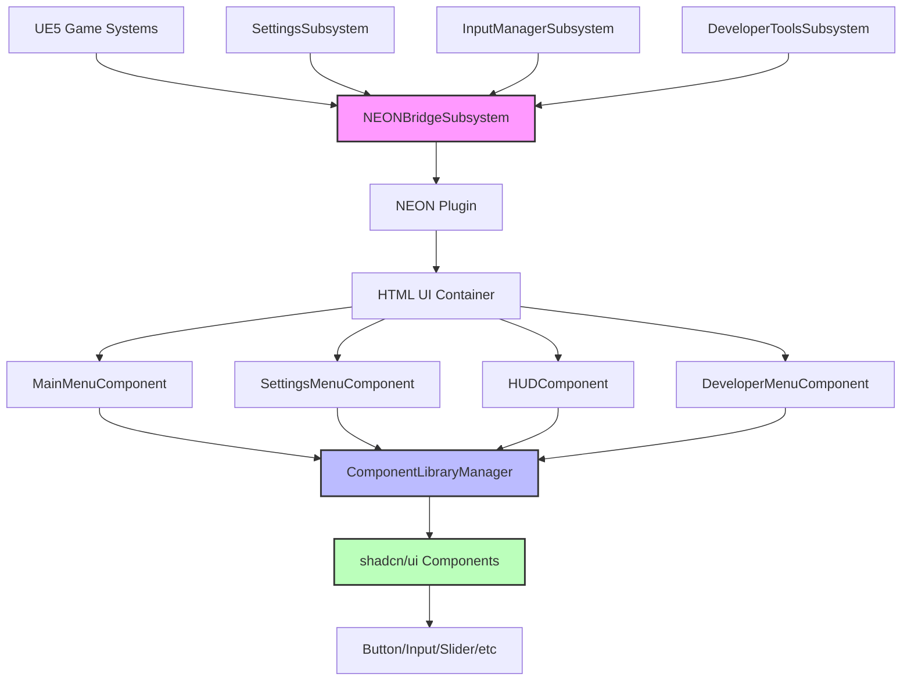

# Components

Based on the architectural patterns, tech stack, and NEON communication layer, the system is divided between **UE5 C++ Subsystems** and **NEON-based HTML UI Components** with clear separation of concerns.

**📚 UE5 Implementation Reference:** See our [UE5 Documentation Cache](../unreal-engine/README.md) for detailed implementation patterns and examples.

### UE5 C++ Subsystems (Backend Components)

#### SettingsSubsystem

**Responsibility:** Centralized management of all game settings with persistence, validation, and Steam Cloud synchronization

**Key Interfaces:**
- `UpdateGraphicsSettings(FGraphicsSettings)` - Apply and validate graphics changes
- `UpdateAudioSettings(FAudioSettings)` - Manage audio device and volume settings
- `UpdateInputSettings(FInputSettings)` - Handle key bindings and sensitivity
- `GetSupportedResolutions()` - Query system capabilities
- `ValidateSettingsChange(FString, FString)` - Pre-validate setting changes
- `SyncToSteamCloud()` - Steam Cloud save synchronization

**Dependencies:** UE5 Config System, Steam API, Audio Device Manager, Display Manager

**Technology Stack:** C++20, UE5 Subsystem Framework, Steam API integration

#### InputManagerSubsystem

**Responsibility:** Multi-platform input detection, controller switching, and dynamic UI prompt management

**Key Interfaces:**
- `GetCurrentInputMode()` - Detect active input device (Keyboard/Gamepad/SteamDeck)
- `UpdateInputPrompts(InputMode)` - Generate appropriate UI icons/text
- `RebindAction(FString, FString)` - Runtime key/button remapping
- `ValidateInputBinding(FString, FString)` - Check for conflicts
- `GetInputPromptsForUI()` - Return current prompt mappings for NEON

**Dependencies:** Steam Input API, UE5 Enhanced Input System, Controller Detection

**Technology Stack:** C++20, UE5 Enhanced Input, Steam Input API

#### DeveloperToolsSubsystem

**Responsibility:** Debug visualization, performance monitoring, console commands, and development utilities

**Key Interfaces:**
- `ToggleDebugOverlay()` - Show/hide collision visualization
- `TogglePerformanceMetrics()` - FPS, memory, draw calls display
- `SetTimeScale(float)` - Modify game time for testing
- `ExecuteConsoleCommand(FString)` - Runtime console command execution
- `GetDebugInfo()` - Current performance metrics for UI

**Dependencies:** UE5 Debug Draw, Console Manager, Stats System

**Technology Stack:** C++20, UE5 Debug Framework, UE5 Stats System

#### NEONBridgeSubsystem

**Responsibility:** Manages communication between UE5 systems and NEON widgets, ensuring type-safe data transfer

**Key Interfaces:**
- `SendToNEON(FString EventName, FJsonObject Data)` - Invoke NEON callbacks
- `RegisterNEONEvent(FString EventName, Delegate)` - Handle NEON→UE5 events
- `RegisterNEONFunction(FString FunctionName, Delegate)` - Handle NEON→UE5 functions
- `BatchHUDUpdates(FHUDUpdateData)` - Optimize real-time UI updates

**Dependencies:** NEON Plugin API, JSON Serialization, UE5 Delegate System

**Technology Stack:** C++20, NEON Plugin, UE5 JSON, Blueprint Integration

### NEON HTML UI Components (Frontend Components)

#### MainMenuComponent

**Responsibility:** Primary game entry point with navigation to game sessions and settings

**Key Interfaces:**
- `navigateToGame()` - Start new game session
- `navigateToSettings()` - Open settings menu
- `exitGame()` - Quit application
- `handleSteamOverlay()` - Steam platform integration

**Dependencies:** shadcn Button, Card components, NEON bridge communication

**Technology Stack:** HTML5, shadcn/ui, Tailwind CSS, Vanilla JavaScript

#### SettingsMenuComponent

**Responsibility:** Comprehensive settings interface with real-time preview and validation

**Key Interfaces:**
- `renderGraphicsTab()` - Resolution, FPS, quality settings with shadcn Slider/Select
- `renderAudioTab()` - Volume controls with shadcn Slider, device selection
- `renderInputTab()` - Key binding interface with shadcn Input/Button
- `validateAndApplySettings()` - Real-time validation and UE5 communication
- `resetToDefaults()` - Restore default configurations

**Dependencies:** shadcn Tabs, Slider, Select, Button, Input, Alert components

**Technology Stack:** HTML5, shadcn/ui, Tailwind CSS, Framer Motion animations

#### HUDComponent

**Responsibility:** Real-time game state visualization with minimal performance impact

**Key Interfaces:**
- `updateHealthBar(health, maxHealth)` - Animated health display with shadcn Progress
- `updateScore(score)` - Score display with count-up animations
- `updateObjectives(objectives)` - Mission progress with shadcn Badge/Progress
- `showNotification(type, message)` - Toast notifications with shadcn Toast
- `updateMiniMap(position, objectives)` - Spatial awareness display

**Dependencies:** shadcn Progress, Badge, Toast, custom game-specific elements

**Technology Stack:** HTML5, shadcn/ui, Framer Motion, optimized for 60fps updates

#### DeveloperMenuComponent

**Responsibility:** Debug tools and development utilities overlay

**Key Interfaces:**
- `togglePerformanceMetrics()` - Show FPS, memory, draw calls
- `renderConsoleInterface()` - Command input with shadcn Input/Button
- `toggleDebugVisualization()` - Collision/navigation display controls
- `renderTimeControls()` - Time scale manipulation with shadcn Slider
- `displaySystemInfo()` - Hardware and engine information

**Dependencies:** shadcn Input, Button, Slider, Card, Collapsible components

**Technology Stack:** HTML5, shadcn/ui, Tailwind CSS, real-time data binding

#### ComponentLibraryManager

**Responsibility:** Shared shadcn component configurations and game-specific theming

**Key Interfaces:**
- `getButtonVariants()` - Game-appropriate button styles (Primary/Secondary/Destructive)
- `getFormComponents()` - Pre-configured Slider/Input/Select with validation
- `getLayoutComponents()` - Card/Dialog/Sheet for consistent layouts
- `getAnimationPresets()` - Framer Motion configurations for UI transitions
- `applyGameTheme()` - Dynamic theming for different game projects

**Dependencies:** Complete shadcn/ui component suite, Framer Motion, CSS custom properties

**Technology Stack:** HTML5, shadcn/ui, Tailwind CSS, CSS custom properties, Framer Motion

### Component Integration Diagram


