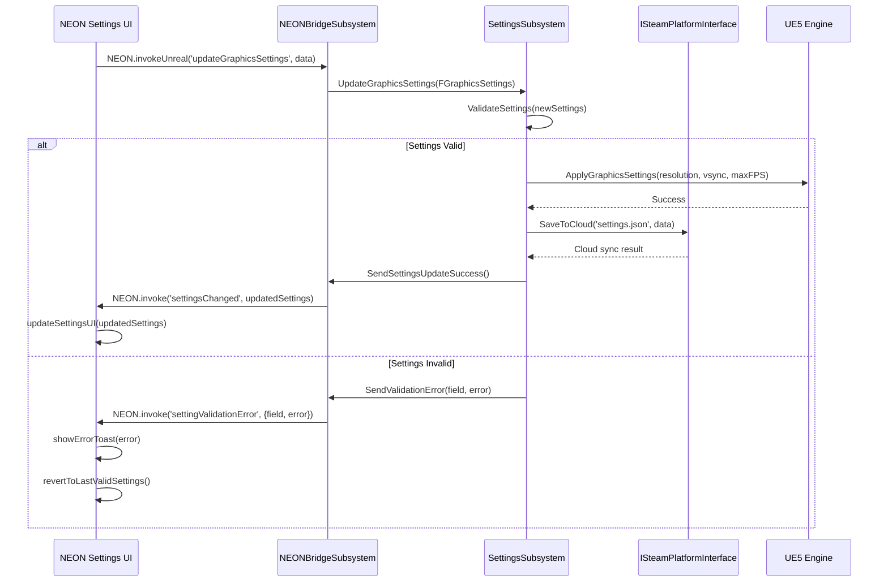
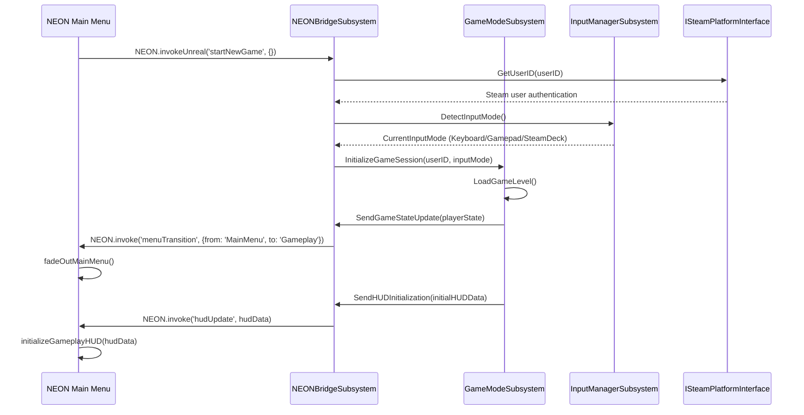
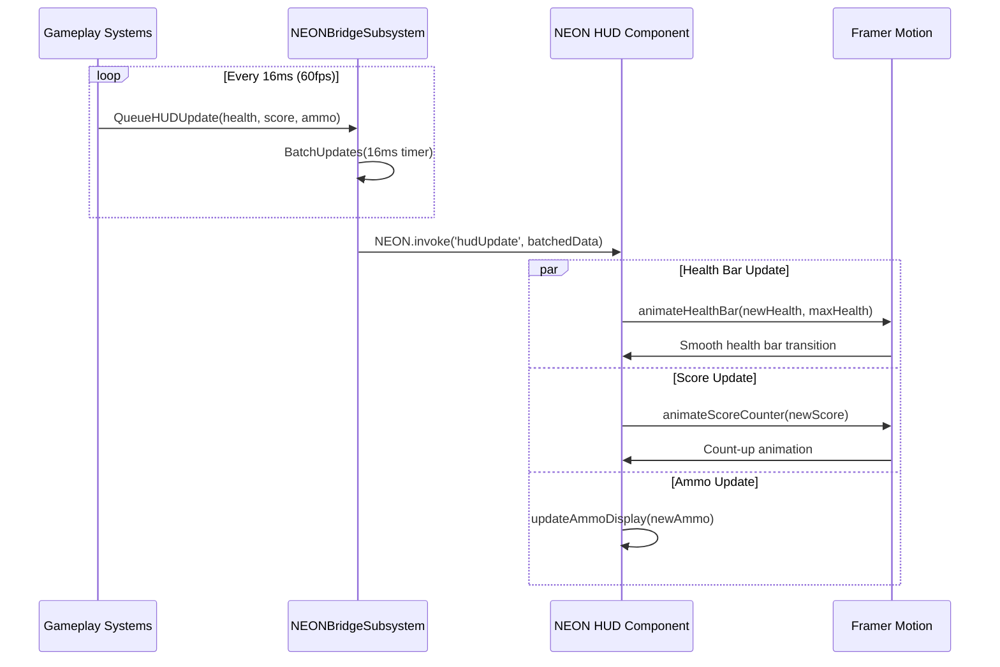
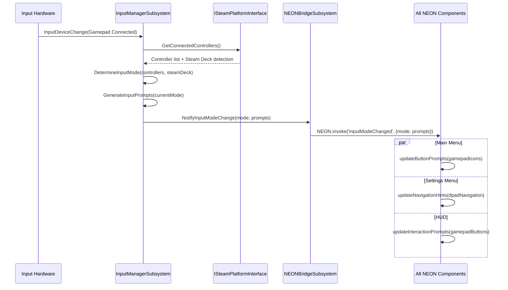
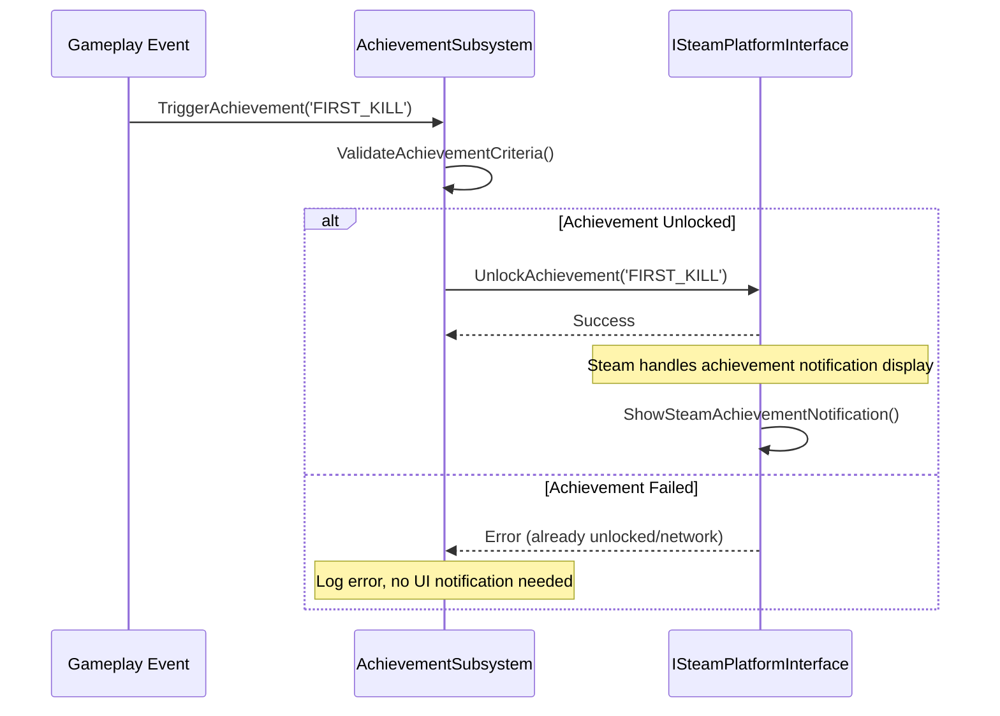
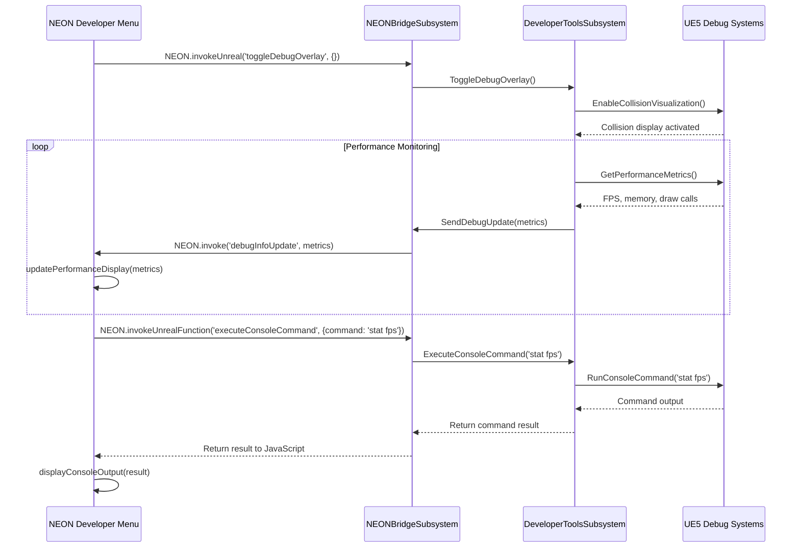

# Core Workflows

Key system workflows illustrating component interactions, NEON communication patterns, and Steam platform integration through the modular interface.

### Settings Update Workflow



### Game Launch Workflow



### Real-time HUD Update Workflow



### Input Mode Detection Workflow



### Steam Achievement Unlock Workflow



### Developer Tools Workflow



### Error Handling Workflow

```mermaid
sequenceDiagram
    participant UI as NEON Component
    participant Bridge as NEONBridgeSubsystem
    participant Subsystem as Any UE5 Subsystem
    participant Steam as ISteamPlatformInterface

    UI->>Bridge: NEON.invokeUnreal('updateSettings', invalidData)
    Bridge->>Subsystem: ProcessSettingsUpdate(invalidData)
    Subsystem->>Subsystem: ValidateData(invalidData)
    
    alt Validation Error
        Subsystem->>Bridge: SendValidationError(field, errorMessage)
        Bridge->>UI: NEON.invoke('settingValidationError', {field, error})
        UI->>UI: showFieldError(field, error)
        UI->>UI: highlightInvalidField(field)
    else Steam Communication Error
        Subsystem->>Steam: SaveToCloud(data)
        Steam-->>Subsystem: Network error
        Subsystem->>Bridge: SendCloudSyncError(errorCode)
        Bridge->>UI: NEON.invoke('showNotification', {
            type: 'warning',
            message: 'Settings saved locally, cloud sync failed'
        })
        UI->>UI: showRetryOption()
    end
```

