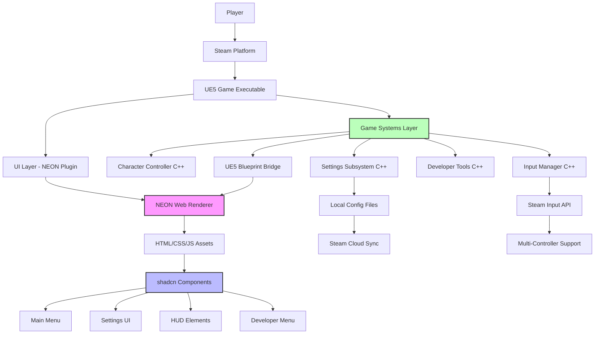

# High Level Architecture

### Technical Summary

**NohamBaseProject** employs a **hybrid native-web architecture** within Unreal Engine 5.5.4, where traditional C++ game systems are coupled with HTML/JavaScript UI layers via NEON plugin integration. The frontend uses **shadcn components** rendered within UE5 widgets, replacing traditional UMG with modern web UI patterns while maintaining native game performance. The backend consists of **modular UE5 subsystems** handling core gameplay, input management, and settings persistence. This architecture enables **rapid prototype development** by leveraging familiar web development workflows for UI creation while preserving the performance and platform integration capabilities of native UE5 development. **Steam PC deployment** with Steam Deck compatibility drives the platform strategy, focusing on desktop gaming performance with controller input support.

### Platform and Infrastructure Choice

Based on PRD requirements and the unique UE5+web hybrid approach, here are the viable platform options:

**Option 1: Steam Direct Deployment (Recommended)**
- **Pros:** Direct Steam integration, native performance, offline distribution, full UE5 feature access
- **Cons:** Requires Steam partnership, manual update distribution
- **Fit:** Perfect for indie game development with established Steam presence

**Option 2: Epic Games Store + UE5 Native**
- **Pros:** UE5 native toolchain, potentially reduced Epic Store fees
- **Cons:** Smaller market reach, less mature platform features
- **Fit:** Good alternative but Steam is specified as primary target

**Option 3: Multi-Platform (Steam + Epic + Itch.io)**
- **Pros:** Maximum market reach, diversified revenue streams
- **Cons:** Increased testing complexity, multiple deployment pipelines
- **Fit:** Future consideration after Steam validation

**Recommendation:** **Steam Direct with UE5 native deployment**
- Aligns with PRD's Steam PC primary focus
- Leverages existing studio success on Steam platform
- Native UE5 compilation maintains performance requirements
- Steam API integration supports controller detection and Steam Deck optimization

**Platform:** Steam PC (Primary), Steam Deck (Secondary)
**Key Services:** Steam API, Steam Input, Steam Cloud Saves, Steam Workshop (future)
**Deployment Host and Regions:** Steam global distribution network
**Performance Target:** 120+ FPS on medium hardware, 60+ FPS on Steam Deck

### Repository Structure

For UE5 projects with HTML UI integration, a **modified monorepo approach** works best:

**Structure:** Modified UE5 Monorepo with Web Assets Integration
**Monorepo Tool:** Native UE5 project structure with organized web assets
**Package Organization:** UE5 modules + HTML/CSS/JS components as content assets

This approach treats HTML/CSS/JS as **content assets** within the UE5 structure rather than separate packages, maintaining UE5's build system while organizing web components logically.

### High Level Architecture Diagram

### Architectural Patterns

- **Hybrid Native-Web Architecture:** UE5 C++ backend with HTML/JavaScript frontend via NEON plugin - _Rationale:_ Combines native performance with rapid web UI development workflows
- **Component-Based UI:** Reusable shadcn components within NEON widgets - _Rationale:_ Leverages mature web component ecosystem while maintaining game engine integration
- **Subsystem Pattern:** UE5 subsystems for cross-cutting concerns (input, settings, developer tools) - _Rationale:_ Ensures proper lifecycle management and global access across game systems
- **Bridge Pattern:** C++ to Blueprint to NEON communication layer - _Rationale:_ Enables type-safe communication between native code and web UI without tight coupling
- **Asset-Based Web Components:** HTML/CSS/JS treated as UE5 content assets - _Rationale:_ Maintains UE5 packaging and deployment workflows while organizing web code
- **Event-Driven UI Updates:** Game state changes trigger UI updates via event system - _Rationale:_ Ensures UI stays synchronized with game state without performance overhead

