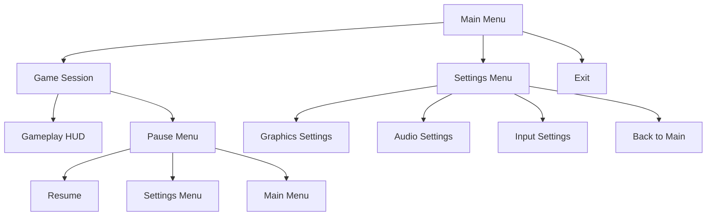
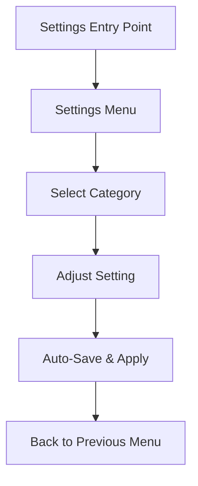

# NohamBaseProject UI/UX Specification

## Introduction

This document defines the user experience goals, information architecture, user flows, and visual design specifications for NohamBaseProject's user interface. It serves as the foundation for visual design and frontend development, ensuring a cohesive and user-centered experience.

## Overall UX Goals & Principles

### Target User Personas

**Primary User: Indie Game Developer**
- Technical professionals working on Steam game development
- Need rapid prototyping capabilities and efficient workflows
- Prioritize functionality and speed over aesthetic polish
- Will customize and extend the base system for specific game projects

**Secondary User: Development Team Members**
- Artists, designers, and other developers who need to quickly understand and modify systems
- Require clear, logical organization of tools and features
- Need consistent patterns they can build upon

### Usability Goals

- **Rapid Setup**: New game projects can be spun up from base in under 10 minutes
- **Developer Efficiency**: Common game development tasks accessible with minimal clicks
- **Clear Extension Points**: Obvious where and how to customize for specific game needs
- **Consistent Patterns**: Reusable UI patterns that work across different game genres
- **Minimal Cognitive Load**: Barebones interface that doesn't distract from game development

### Design Principles

1. **Function Over Form** - Prioritize developer productivity over visual sophistication
2. **Modularity First** - Every UI component should be easily replaceable and extensible  
3. **Convention Over Configuration** - Use familiar patterns that developers expect
4. **Progressive Enhancement** - Start minimal, add complexity only when needed
5. **Steam-Ready Foundation** - Ensure compatibility with Steam's requirements and best practices

### Change Log

| Date | Version | Description | Author |
|------|---------|-------------|---------|
| 2025-10-25 | 1.0 | Initial UX goals and principles defined | Sally (UX Expert) |

## Information Architecture (IA)

### Site Map / Screen Inventory



### Navigation Structure

**Primary Navigation:** Simple centered vertical menu structure
- Main Menu: Image (top center) + vertical button stack (Game/Settings/Exit)
- All menus follow same centered, minimal layout pattern
- Single-level navigation - no complex hierarchies

**Secondary Navigation:** Basic back/return functionality
- Settings submenu with back button to Main Menu
- Pause menu with resume/settings/main menu options

**Breadcrumb Strategy:** None needed - simple back buttons sufficient for shallow navigation

### Layout Template

**Main Menu Structure:**
```
    [Centered Game Logo/Image]
           (upper viewport)
    
         [  Game  ]
         [Settings]
         [ Exit  ]
    (centered vertical button stack)
```

**Consistent Pattern:** All menus inherit this centered, minimal approach for maximum reusability across different game projects.

## User Flows

### Start New Game Session

**User Goal:** Get into gameplay as quickly as possible for testing/development  
**Entry Points:** Main Menu "Game" button  
**Success Criteria:** Player in functional game state within 3 clicks

#### Flow Diagram
```mermaid
graph TD
    A[Main Menu] --> B[Click "Game"]
    B --> C[Game Scene Loads]
    C --> D[Gameplay Active]
    D --> E[ESC Key] 
    E --> F[Pause Menu]
    F --> G[Resume/Settings/Main Menu]
```

#### Edge Cases & Error Handling:
- Loading failure → Error message with "Return to Main Menu" option
- Save corruption → Default to new game state
- Input not responding → Show input debugging overlay

**Notes:** Prioritizes immediate access to gameplay for rapid development iteration

### Access Settings & Configuration

**User Goal:** Quickly adjust settings for testing different configurations  
**Entry Points:** Main Menu "Settings" or Pause Menu "Settings"  
**Success Criteria:** Setting changed and applied immediately

#### Flow Diagram


#### Edge Cases & Error Handling:
- Invalid setting value → Revert to previous valid value
- Setting requires restart → Clear notification with restart button
- Settings file corruption → Reset to defaults with notification

**Notes:** Emphasizes immediate feedback and minimal friction for developer testing workflows

## Wireframes & Mockups

### Design Architecture Approach

**Primary Technology:** HTML/CSS/JavaScript UI through NEON plugin  
**Container Strategy:** Minimal UMG widgets serve only as viewport containers for HTML content  
**Communication Layer:** Bidirectional binding system between HTML UI and Unreal game logic

**Key Technical Requirements:**
- Efficient data binding for real-time updates (health bars, scores, etc.)
- Event system for UI interactions to trigger game functions
- Performance optimization for frequent UI updates during gameplay
- Clean separation between presentation (HTML/CSS) and game logic (Unreal)

### Key Screen Layouts

#### Main Menu Layout
**Purpose:** HTML-based foundation template for all future game main menus  
**Key Elements:**
- HTML structure with CSS Grid/Flexbox for centered layout
- Placeholder image element (easily swappable via CSS/JavaScript)
- Semantic button elements with consistent styling
- Responsive design principles for different screen resolutions
- JavaScript event handlers for menu navigation

**File Structure:**
- `Content/UI/HTML/MainMenu/index.html` - HTML structure
- `Content/UI/HTML/MainMenu/styles.css` - Visual styling
- `Content/UI/HTML/MainMenu/main.js` - Interaction logic
- `Content/UI/Containers/WBP_MainMenu_Container.uasset` - UMG container widget

#### Settings Menu Layout  
**Purpose:** HTML-based settings interface framework with game binding  
**Key Elements:**
- Tab-based navigation using HTML/CSS
- Form controls (range inputs, select dropdowns, checkboxes)
- Real-time value display and validation
- JavaScript functions bound to Unreal settings system
- Auto-save feedback with visual confirmation

**Communication Requirements:**
- Read current settings from Unreal on load
- Update Unreal settings immediately on change
- Handle setting validation and error states

#### HUD/Gameplay Interface
**Purpose:** Real-time game data display with minimal performance impact  
**Key Elements:**
- Health/status bars with smooth animations
- Score displays with number formatting
- Mini-map or objective indicators
- Chat/notification system overlay

**Performance Considerations:**
- Efficient update patterns (only change what's needed)
- Debounced updates for rapidly changing values
- Minimal DOM manipulation for 60fps performance

### UI-Game Communication Strategy

**Unreal to HTML Updates:**
- Event-driven system for game state changes
- Batched updates for performance optimization
- Direct property binding for frequently updated values

**HTML to Unreal Commands:**
- JavaScript function calls mapped to Unreal Blueprint events
- Parameter validation before sending to game logic
- Async feedback for operations that take time

**Rationale:** HTML/CSS provides superior styling flexibility and web development workflows while NEON plugin ensures native performance. This approach allows rapid UI iteration using familiar web technologies while maintaining tight integration with Unreal game systems.

## Component Library / Design System

### Design System Approach

**Framework:** SHADCN UI Components  
**Strategy:** Pre-download and package components for offline use within Unreal projects  
**Advantages:**
- Abundant open-source component library with professional design quality
- Multiple theme options available for instant visual variety
- Comprehensive documentation from original designers
- Saves countless development hours vs. building custom components
- Proven accessibility and responsive design patterns

### Core Components (SHADCN-Based)

#### Button Component
**SHADCN Source:** `ui/button` component  
**Purpose:** Primary interactive element across all game interfaces  
**Variants:** Default, Destructive, Outline, Secondary, Ghost, Link  
**States:** Default, Hover, Focus, Disabled, Loading  
**Usage Guidelines:** 
- Use Default for primary actions (Start Game)
- Use Destructive for exits and dangerous actions
- Use Ghost for subtle navigation (Back buttons)

**Integration:** Pre-packaged in `Content/UI/HTML/Components/shadcn/button/`

#### Form Controls
**SHADCN Sources:** `ui/slider`, `ui/select`, `ui/switch`, `ui/input`  
**Purpose:** Settings interface building blocks  
**Components:**
- Slider: Graphics quality, volume controls
- Select: Resolution, graphics presets
- Switch: Fullscreen, VSync toggles  
- Input: Player name, key binding inputs

**Integration:** Pre-packaged in `Content/UI/HTML/Components/shadcn/form/`

#### Layout Components
**SHADCN Sources:** `ui/card`, `ui/dialog`, `ui/sheet`  
**Purpose:** Content containers and modal overlays  
**Components:**
- Card: Settings panels, information displays
- Dialog: Confirmation dialogs, error messages
- Sheet: Side panels, slide-out menus

#### Game-Specific HUD Components  
**SHADCN Sources:** `ui/progress`, `ui/badge`, `ui/toast`  
**Purpose:** Real-time game data visualization  
**Components:**
- Progress: Health bars, loading indicators, experience bars
- Badge: Score displays, notification counters, status indicators
- Toast: Achievement notifications, error messages, system alerts

### Theme Strategy

**Base Themes Available:**
- Default (neutral gray palette)
- Dark (popular for gaming interfaces)
- Light (accessibility option)
- Custom game-specific themes via CSS variable overrides

**Theme Implementation:**
- CSS custom properties for rapid theme switching
- Pre-configured theme packages for common game genres
- Easy customization through SHADCN's design token system

### File Organization

```
Content/UI/HTML/
├── Components/
│   └── shadcn/
│       ├── button/
│       ├── form/
│       ├── layout/
│       └── themes/
├── MainMenu/
├── Settings/
└── HUD/
```

### Documentation Integration

**Built-in Benefits:**
- Each component comes with SHADCN's original documentation
- Copy-paste examples for rapid implementation
- Accessibility guidelines included
- Responsive behavior documented
- Customization options clearly outlined

**Rationale:** SHADCN provides professional-quality components with minimal setup time, allowing focus on game-specific functionality rather than UI component development. The comprehensive documentation and theme system accelerate development while ensuring consistent, accessible interfaces across all future game projects.

## Branding & Style Guide

### Visual Identity
**Base Theme:** SHADCN Default Dark Theme  
**Customization Strategy:** Start with Default Dark, document how future games can override CSS custom properties for rapid rebranding

### Color Palette (SHADCN Default Dark)

| Color Type | CSS Variable | Usage |
|------------|--------------|--------|
| Background | `--background` | Main background color |
| Foreground | `--foreground` | Primary text color |
| Primary | `--primary` | Main action buttons, active states |
| Primary Foreground | `--primary-foreground` | Text on primary color |
| Secondary | `--secondary` | Secondary buttons, subtle backgrounds |
| Secondary Foreground | `--secondary-foreground` | Text on secondary color |
| Muted | `--muted` | Subtle backgrounds, disabled states |
| Muted Foreground | `--muted-foreground` | Secondary text, placeholders |
| Accent | `--accent` | Highlights, links, interactive elements |
| Accent Foreground | `--accent-foreground` | Text on accent color |
| Destructive | `--destructive` | Error states, dangerous actions |
| Destructive Foreground | `--destructive-foreground` | Text on destructive color |
| Border | `--border` | Component borders |
| Input | `--input` | Form input backgrounds |
| Ring | `--ring` | Focus ring color |

### Customization for Future Games

**Theme Override Example:**
```css
/* Custom game theme - override in game-specific CSS */
:root {
  --primary: 210 40% 15%;        /* Custom primary color */
  --primary-foreground: 0 0% 98%; /* Text on primary */
  --accent: 142 76% 36%;          /* Custom accent color */
  /* Override any other colors as needed */
}
```

**Available SHADCN Themes for Quick Switching:**
- Default Dark (base choice)
- Default Light 
- New York (alternative styling)
- Community themes: Rose, Blue, Green, Orange, Red, Yellow, Violet

### Typography

#### Font Families
- **Primary:** SHADCN default font stack (Inter via `font-sans`)
- **Monospace:** SHADCN default mono stack (`font-mono`)

#### Type Scale (SHADCN Classes)

| Element | SHADCN Classes |
|---------|----------------|
| H1 | `scroll-m-20 text-4xl font-extrabold tracking-tight lg:text-5xl` |
| H2 | `scroll-m-20 border-b pb-2 text-3xl font-semibold tracking-tight` |
| H3 | `scroll-m-20 text-2xl font-semibold tracking-tight` |
| Body | `leading-7 [&:not(:first-child)]:mt-6` |
| Small | `text-sm text-muted-foreground` |
| Large | `text-lg font-semibold` |

### Iconography
**Icon Library:** Lucide React (SHADCN standard)  
**Usage Guidelines:** 
- Use semantic icons from Lucide library
- Consistent sizing with SHADCN icon classes (`h-4 w-4`, `h-5 w-5`, etc.)
- Maintain SHADCN's icon styling patterns

### Spacing & Layout
**Grid System:** SHADCN's container and grid utilities  
**Spacing Scale:** Tailwind CSS spacing scale (SHADCN standard)

**Base Layout Classes:**
```css
/* SHADCN container pattern */
.container {
  @apply mx-auto max-w-7xl px-4 sm:px-6 lg:px-8;
}

/* Centered game menu pattern */
.game-menu-container {
  @apply min-h-screen flex flex-col items-center justify-center p-8;
}
```

### Theme Integration Files

**Required Files:**
- `globals.css` - SHADCN Dark theme CSS variables
- `tailwind.config.js` - SHADCN configuration
- `components.json` - SHADCN component configuration

**Customization Workflow:**
1. Start with SHADCN Default Dark theme
2. For new games: override CSS custom properties in game-specific stylesheet
3. Optional: Generate new theme using SHADCN theme generator
4. Test components maintain functionality with new colors

**Rationale:** Using SHADCN's actual Default Dark theme provides a professional gaming-appropriate foundation. The CSS custom property system allows rapid rebranding for future games while maintaining component functionality and accessibility standards.

## Accessibility Requirements

### Compliance Target
**Standard:** Gaming-focused accessibility for Steam platform compatibility  
**Focus:** Visual accessibility, keyboard navigation, and controller support

### Key Requirements

**Visual:**
- Color contrast ratios: SHADCN components provide adequate contrast by default
- Colorblind accessibility: Avoid red/green only distinctions, use additional visual cues
- Text sizing: Support user scaling for vision impairments
- High contrast mode compatibility for Windows users

**Interaction:**
- Keyboard navigation: Full menu navigation without mouse (essential for Steam Controller)
- Steam Controller support: UI navigable with controller d-pad/analog stick
- Consistent focus indicators: Clear visual feedback for current selection
- Logical tab order: Intuitive navigation flow through menus

**Gaming-Specific:**
- Subtitle framework: Text display system for audio content
- Difficulty accessibility: Easy settings adjustment for motor impairments
- Pause-anywhere capability: Critical for players who need breaks
- Clear visual feedback: Action confirmations, state changes

### Implementation Strategy

**SHADCN Benefits:**
- Built-in keyboard navigation patterns
- Focus management handled automatically
- Consistent interaction patterns across components

**Testing Approach:**
- Keyboard-only navigation testing
- Steam Controller navigation verification
- Colorblind simulation testing
- High contrast mode testing

**Rationale:** Focus on accessibility features that enhance the gaming experience for players with disabilities while ensuring compatibility with Steam platform expectations and controller-based navigation.

## Responsiveness Strategy

### Breakpoints

| Breakpoint | Min Width | Max Width | Target Devices | Notes |
|------------|-----------|-----------|----------------|-------|
| Mobile | 320px | 767px | Steam Deck portrait, small windows | Rare but possible |
| Steam Deck | 768px | 1279px | Steam Deck landscape (800x1280) | Primary handheld target |
| Desktop | 1280px | 1919px | Standard desktop gaming | Most common |
| Ultrawide | 1920px | - | Ultrawide monitors, multiple displays | Growing segment |

### Adaptation Patterns

**Layout Changes:**
- Mobile/Steam Deck: Single column, larger touch targets, simplified navigation
- Desktop: Multi-column layouts allowed, standard button sizes
- Ultrawide: Center content, use extra space for ambient backgrounds

**Navigation Changes:**
- Steam Deck: Larger buttons for finger/controller navigation, more spacing
- Desktop: Standard sizing, mouse-optimized hover states
- All: Consistent keyboard/controller navigation regardless of screen size

**Content Priority:**
- Small screens: Hide non-essential UI elements, prioritize core gameplay controls
- Large screens: Show additional information, richer visual details
- Steam Deck: Optimize for readability at arm's length

**Interaction Changes:**
- Touch-friendly sizing on Steam Deck (minimum 44px targets)
- Hover states only on desktop (not applicable to Steam Deck)
- Focus indicators work across all input methods

**SHADCN Integration:**
- Built-in Tailwind responsive classes (`sm:`, `md:`, `lg:`, `xl:`)
- Components adapt automatically to screen size
- Container classes handle width constraints

## Animation & Micro-interactions

### Motion Library
**Framework:** Framer Motion  
**Strategy:** Pre-canned animation presets for consistent, beautiful motion across all UI components  
**Benefits:** 
- Industry-standard animation library with excellent performance
- Declarative animations that are easy to implement and maintain
- Built-in gesture support and accessibility features
- Extensive preset library for common UI patterns

### Motion Principles
- **Purposeful Motion:** Every animation serves a functional purpose (feedback, state change, navigation)
- **Performance Optimized:** Hardware-accelerated animations that don't impact game performance
- **Consistent Easing:** Standardized timing functions across all animations
- **Accessibility First:** Automatic reduced motion support built into Framer Motion

### Pre-Canned Animation Presets

#### Button Animations
**Hover Animation:**
```javascript
const buttonHover = {
  scale: 1.02,
  transition: { duration: 0.15, ease: "easeOut" }
}

const buttonTap = {
  scale: 0.98,
  transition: { duration: 0.1, ease: "easeInOut" }
}
```

**Loading State:**
```javascript
const buttonLoading = {
  opacity: [1, 0.7, 1],
  transition: { duration: 1.5, repeat: Infinity, ease: "easeInOut" }
}
```

#### Menu Transitions
**Slide In/Out:**
```javascript
const menuSlide = {
  initial: { x: "-100%", opacity: 0 },
  animate: { x: 0, opacity: 1 },
  exit: { x: "-100%", opacity: 0 },
  transition: { duration: 0.25, ease: "easeInOut" }
}
```

**Fade Transition:**
```javascript
const fadeTransition = {
  initial: { opacity: 0 },
  animate: { opacity: 1 },
  exit: { opacity: 0 },
  transition: { duration: 0.2 }
}
```

#### HUD Element Animations
**Health Bar Changes:**
```javascript
const healthBarUpdate = {
  scaleX: [1, 1.02, 1],
  transition: { duration: 0.3, ease: "easeOut" }
}
```

**Score Count-Up:**
```javascript
const scoreUpdate = {
  scale: [1, 1.1, 1],
  transition: { duration: 0.4, ease: "backOut" }
}
```

**Notification Toast:**
```javascript
const toastSlide = {
  initial: { x: "100%", opacity: 0 },
  animate: { x: 0, opacity: 1 },
  exit: { x: "100%", opacity: 0 },
  transition: { type: "spring", stiffness: 300, damping: 30 }
}
```

#### Form Feedback Animations
**Error Shake:**
```javascript
const errorShake = {
  x: [0, -10, 10, -10, 10, 0],
  transition: { duration: 0.4 }
}
```

**Success Confirmation:**
```javascript
const successPulse = {
  scale: [1, 1.05, 1],
  transition: { duration: 0.3, ease: "easeOut" }
}
```

### Animation Component Library

**Standardized Wrapper Components:**
- `<AnimatedButton>` - Pre-configured button with hover/tap animations
- `<SlideMenu>` - Menu container with slide transitions
- `<FadeContainer>` - Content wrapper with fade in/out
- `<PulseOnChange>` - Wrapper that pulses when children change
- `<ShakeOnError>` - Form element wrapper with error feedback

### Integration with SHADCN

**Enhanced SHADCN Components:**
```javascript
// Example: Animated SHADCN Button
import { motion } from "framer-motion"
import { Button } from "@/components/ui/button"

const AnimatedButton = motion(Button)

// Usage with pre-canned animations
<AnimatedButton
  whileHover={buttonHover}
  whileTap={buttonTap}
  variants={buttonLoading}
  animate={isLoading ? "loading" : "idle"}
>
  Start Game
</AnimatedButton>
```

### Performance Considerations
- Use `transform` and `opacity` properties for hardware acceleration
- Batch animations with `AnimatePresence` for smooth mount/unmount
- Leverage Framer Motion's automatic will-change optimization
- Respect `prefers-reduced-motion` automatically handled by Framer Motion

**Rationale:** Framer Motion provides professional-quality animations with minimal setup while maintaining excellent performance. Pre-canned animation presets ensure consistency across all future game projects while allowing easy customization when needed.

## Performance Considerations

### Performance Goals
- **UI Frame Rate:** Maintain 60fps for all UI animations and interactions
- **Game Impact:** UI operations should not cause game frame drops
- **Memory Usage:** Efficient DOM management to prevent memory leaks
- **Load Time:** Fast UI initialization and menu transitions

### Design Strategies for NEON Performance

**DOM Optimization:**
- Minimize DOM elements: Use CSS for visual effects instead of extra HTML elements
- Efficient re-renders: Update only changed elements, avoid full page re-renders
- Component recycling: Reuse UI components instead of creating/destroying

**CSS Performance:**
- Hardware acceleration: Use `transform` and `opacity` for animations (Framer Motion handles this)
- Avoid layout thrashing: Minimize properties that trigger reflow (width, height, position)
- Efficient selectors: Use specific classes instead of complex CSS selectors

**JavaScript Optimization:**
- Debounced updates: Batch rapid UI updates (health bars, scores) to reduce render calls
- Event delegation: Use single event listeners instead of multiple element listeners
- Memory management: Proper cleanup of event listeners and animations on component unmount

**SHADCN + Framer Motion Performance:**
```javascript
// Efficient animation patterns
const optimizedAnimation = {
  // Good: Uses transform (hardware accelerated)
  scale: [1, 1.02, 1],
  // Avoid: Properties that cause layout recalculation
  // width: ["100px", "110px", "100px"] ❌
}

// Debounced UI updates for rapid changes
const debouncedHealthUpdate = useMemo(
  () => debounce((newHealth) => setHealth(newHealth), 16), // ~60fps
  []
)
```

**NEON-Specific Optimizations:**
- Minimize communication between HTML and Unreal: Batch property updates
- Use efficient data binding: Update UI in chunks rather than individual properties
- Optimize texture updates: Reduce frequency of UI texture updates to Unreal renderer

**Asset Management:**
- Preload critical UI assets: Load essential images and fonts upfront
- Lazy load non-critical elements: Load secondary UI components on demand
- Optimize image formats: Use WebP for images, SVG for icons when possible

## Next Steps

### Immediate Actions
1. Set up NEON plugin integration with Unreal Engine base project
2. Install and configure SHADCN UI component library with Default Dark theme
3. Implement Framer Motion animation presets and wrapper components
4. Create base HTML/CSS structure for Main Menu, Settings, and HUD templates
5. Establish bidirectional communication system between HTML UI and Unreal game logic
6. Set up performance monitoring and optimization workflows

### Design Handoff Checklist
- [x] All user flows documented
- [x] Component inventory complete (SHADCN-based)
- [x] Accessibility requirements defined (gaming-focused)
- [x] Responsive strategy clear (Steam Deck + Desktop + Ultrawide)
- [x] Brand guidelines incorporated (SHADCN Default Dark theme)
- [x] Performance goals established (60fps UI, minimal game impact)
- [ ] Technical architecture documentation needed (HTML/NEON integration)
- [ ] Component implementation examples created
- [ ] Animation preset library built
- [ ] Testing protocols established

**Rationale:** This specification provides a complete foundation for rapid indie game UI development using modern web technologies through NEON. The combination of SHADCN components, Framer Motion animations, and performance-optimized patterns enables consistent, professional interfaces that can be quickly customized for each new game project.

---

*Document Status: Complete - Ready for Technical Implementation*  
*Last Updated: 2025-10-25*
